# BEGIN FILE: DIAGRAMAS_FLUJOS_v3.0.md 

# 📊 DIAGRAMAS DE FLUJOS v3.9.2 - COMPLICESCONECTA v3.9.2

#> Actualización 15 Ene 2026 04:27
#> - Advanced Features Actualizado: Descomentado código usando columnas existentes en Supabase
#> - Location compatibility: usando latitude y longitude
#> - Gender compatibility: usando interested_in
#> - Account type compatibility: usando account_type e interested_in
#> - Location-based starters: usando latitude y longitude
#> - Import actualizado a supabase-updated.ts con columnas completas
#> - Type-check pasa exitosamente sin errores

#> Actualización 15 Ene 2026 04:16
#> - Refactorización ContentModeration: Separación de patrones y listas en archivos modulares
#> - Creación de src/lib/moderation/patterns/ con 5 archivos especializados
#> - Reducción de 496 líneas en contentModeration.ts, código más modular y escalable
#> - Type-check pasa exitosamente sin errores
#> - Corrección de accesibilidad en BackgroundControls.tsx (aria-label en botones)

#> Actualización 16 Ene 2026 05:35
#> - Corrección completa de errores de TypeScript y warnings en 27 archivos
#> - Creación de tablas faltantes: media, gallery_unlocks, summary_feedback
#> - Regeneración de tipos de Supabase con nuevas columnas
#> - Corrección de tipo JSONB en couple_images (useCouplePhotos.ts)
#> - Corrección de exactOptionalPropertyTypes en interfaces Post y SummaryFeedback
#> - Instalación de @types/uuid para resolver errores en node_modules
#> - Build exitoso: npm run build:check pasa sin errores (25.28s)

#> Actualización 12 Ene 2026 23:17
#> - Flujo de Seguridad agregado desde v3.5.0
#> - Flujo completo de Club Profiles agregado
#> - Documento consolidado con todos los flujos del proyecto
#> - Eliminados archivos redundantes v3.5.0 y v4.0_DOCUMENTO_MAESTRO_IA.md

#> Este documento es la fuente única de verdad para todos los flujos del proyecto

**Fecha:** 16 Enero 2026
**Versión:** 3.8.3 (Consolidado)
**Estado:** ✅ FLUJOS COMPLETOS - TypeScript Clean - Seguridad + Club Profiles + Usuario + Tokens + NFTs

---

## 📜 Base Normativa

Este documento es la fuente única de verdad para todos los flujos del proyecto ComplicesConecta.

- Todo cambio es acumulativo.
- Toda lógica es determinista.
- Toda ambigüedad se considera error.

---

## �️ FLUJO DE SEGURIDAD

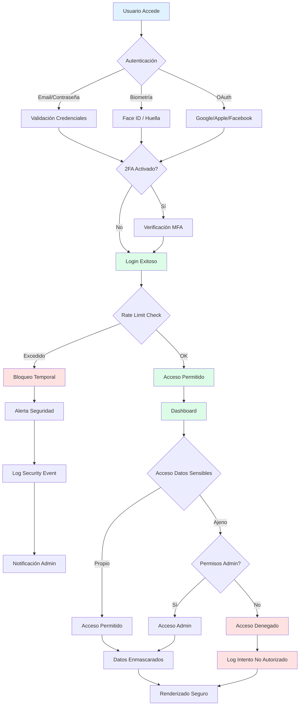
```mermaid
flowchart TD
    A[Usuario Accede] --> B{Autenticación}
    B -->|Email/Contraseña| C[Validación Credenciales]
    B -->|Biometría| D[Face ID / Huella]
    B -->|OAuth| E[Google/Apple/Facebook]

    C --> F{2FA Activado?}
    D --> F
    E --> F

    F -->|Sí| G[Verificación MFA]
    F -->|No| H[Login Exitoso]

    G --> H

    H --> I{Rate Limit Check}
    I -->|Excedido| J[Bloqueo Temporal]
    I -->|OK| K[Acceso Permitido]

    J --> L[Alerta Seguridad]
    K --> M[Dashboard]

    L --> N[Log Security Event]
    N --> O[Notificación Admin]

    M --> P{Acceso Datos Sensibles}
    P -->|Propio| Q[Acceso Permitido]
    P -->|Ajeno| R{Permisos Admin?}
    R -->|Sí| S[Acceso Admin]
    R -->|No| T[Acceso Denegado]

    Q --> U[Datos Enmascarados]
    S --> U
    T --> V[Log Intento No Autorizado]

    U --> W[Renderizado Seguro]
    V --> W

    style A fill:#e0f2fe
    style H fill:#dcfce7
    style K fill:#dcfce7
    style M fill:#dcfce7
    style J fill:#fee2e2
    style T fill:#fee2e2
    style V fill:#fee2e2
```

### Capas de Seguridad Implementadas

1. **Capa 1: Validación de Input**
   - Sanitización de todos los inputs de usuario
   - Validación de formatos (email, UUID)
   - Eliminación de caracteres peligrosos

2. **Capa 2: Autenticación**
   - Contraseñas con bcrypt (cost factor 12)
   - JWT tokens con firma RS256
   - MFA opcional para usuarios premium
   - Autenticación biométrica (Face ID, Huella)

3. **Capa 3: Rate Limiting**
   - 100 requests/minuto por usuario
   - Bloqueo automático de IPs maliciosas
   - Tracking de actividad por IP

4. **Capa 4: Protección XSS**
   - Escapado de HTML en todos los outputs
   - Content Security Policy configurada
   - Sanitización de contenido de usuario

5. **Capa 5: Auditoría**
   - Logging de todos los eventos de seguridad
   - Auditoría de cambios en datos sensibles
   - Monitoreo de actividad sospechosa

6. **Capa 6: Control de Acceso**
   - 65+ políticas RLS activas
   - Validación de permisos por tipo de dato
   - Enmascaramiento de datos sensibles en logs

---

## � FLUJO COMPLETO DE USUARIO (Actualizado v3.6.4)

### ✅ Actualizaciones clave v3.7.2

- **Consolidación de UI:** todos los componentes visuales viven ahora en `src/components/ui/*` con variantes unificadas (love/passion/premium) para controles críticos como el Control Parental. Esto asegura consistencia entre los flujos diagramados y la experiencia real.
- **Arquitectura Vite pura:** se eliminaron los layout folders `src/app/(*)/` heredados de Next.js. Todas las rutas presentes en estos flujos ahora residen en `src/pages/**`, simplificando la trazabilidad entre diagramas ↔ código.
- **Pipelines visuales sincronizados:** los fondos dinámicos (particles/mp4/static) y el nuevo `useBgMode` se aplican tanto en perfiles demo (nodos F/G/H) como en perfiles reales (nodos L/M/N), garantizando que los flujos de usuario reflejen la experiencia Android/iOS.
- **Iconografía Lucide:** los paneles de moderación/alertas (secciones 🛡️ y 🛡️) usan `lucide-react`, lo que evita regresiones en los flujos de baneo y pagos automáticos.

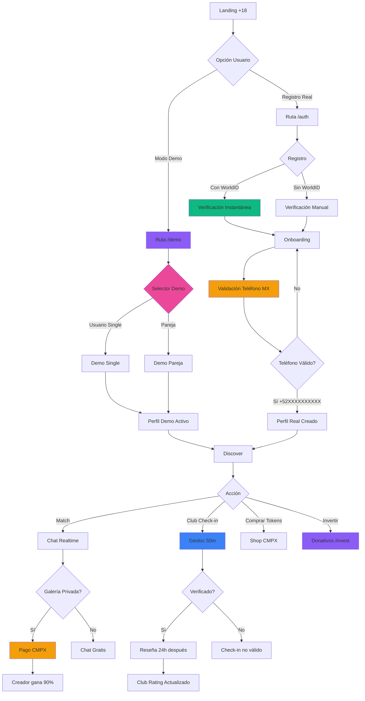
```mermaid
flowchart TD
    A[Landing +18] --> B{Opción Usuario}
    B -->|Modo Demo| C[Ruta /demo]
    B -->|Registro Real| D[Ruta /auth]

    C --> E{Selector Demo}
    E -->|Usuario Single| F[Demo Single]
    E -->|Pareja| G[Demo Pareja]

    F --> H[Perfil Demo Activo]
    G --> H

    D --> I{Registro}
    I -->|Con WorldID| J[Verificación Instantánea]
    I -->|Sin WorldID| K[Verificación Manual]

    J --> L[Onboarding]
    K --> L

    L --> M[Validación Teléfono MX]
    M --> N{Teléfono Válido?}
    N -->|Sí +52XXXXXXXXXX| O[Perfil Real Creado]
    N -->|No| L

    H --> P[Discover]
    O --> P

    P --> Q{Acción}
    Q -->|Match| R[Chat Realtime]
    Q -->|Club Check-in| S[Geoloc 50m]
    Q -->|Comprar Tokens| T[Shop CMPX]
    Q -->|Invertir| U[Donativos /invest]

    S --> V{Verificado?}
    V -->|Sí| W[Reseña 24h después]
    V -->|No| X[Check-in no válido]

    R --> Y{Galería Privada?}
    Y -->|Sí| Z[Pago CMPX]
    Y -->|No| AA[Chat Gratis]

    Z --> AB[Creador gana 90%]
    W --> AC[Club Rating Actualizado]

    style C fill:#8b5cf6
    style E fill:#ec4899
    style J fill:#10b981
    style M fill:#f59e0b
    style S fill:#3b82f6
    style Z fill:#f59e0b
    style U fill:#8b5cf6
```

---

## 🏢 FLUJO DE VERIFICACIÓN DE CLUB

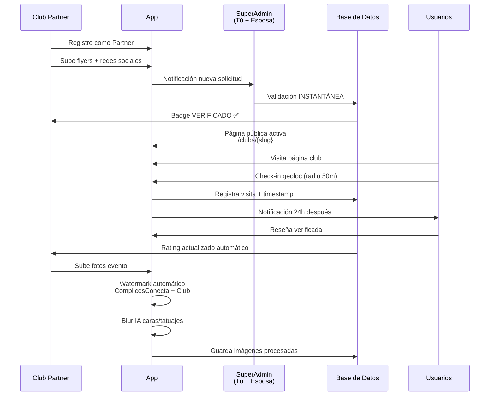
```mermaid
sequenceDiagram
    participant C as Club Partner
    participant A as App
    participant S as SuperAdmin<br/>(Tú + Esposa)
    participant DB as Base de Datos
    participant U as Usuarios

    C->>A: Registro como Partner
    C->>A: Sube flyers + redes sociales
    A->>S: Notificación nueva solicitud
    S->>DB: Validación INSTANTÁNEA
    DB->>C: Badge VERIFICADO ✅
    DB->>A: Página pública activa<br/>/clubs/{slug}

    U->>A: Visita página club
    U->>A: Check-in geoloc (radio 50m)
    A->>DB: Registra visita + timestamp
    A->>U: Notificación 24h después
    U->>A: Reseña verificada
    DB->>C: Rating actualizado automático

    C->>A: Sube fotos evento
    A->>A: Watermark automático<br/>ComplicesConecta + Club
    A->>A: Blur IA caras/tatuajes
    A->>DB: Guarda imágenes procesadas
```

---

## 🛡️ FLUJO DE MODERACIÓN COMPLETO

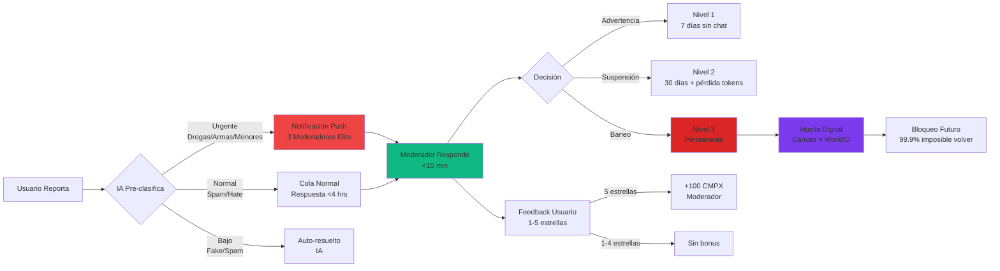
```mermaid
flowchart LR
    A[Usuario Reporta] --> B{IA Pre-clasifica}
    B -->|Urgente<br/>Drogas/Armas/Menores| C[Notificación Push<br/>3 Moderadores Elite]
    B -->|Normal<br/>Spam/Hate| D[Cola Normal<br/>Respuesta <4 hrs]
    B -->|Bajo<br/>Fake/Spam| E[Auto-resuelto<br/>IA]

    C --> F[Moderador Responde<br/><15 min]
    D --> F
    F --> G{Decisión}
    G -->|Advertencia| H[Nivel 1<br/>7 días sin chat]
    G -->|Suspensión| I[Nivel 2<br/>30 días + pérdida tokens]
    G -->|Baneo| J[Nivel 3<br/>Permanente]

    J --> K[Huella Digital<br/>Canvas + WorldID]
    K --> L[Bloqueo Futuro<br/>99.9% imposible volver]

    F --> M[Feedback Usuario<br/>1-5 estrellas]
    M -->|5 estrellas| N[+100 CMPX<br/>Moderador]
    M -->|1-4 estrellas| O[Sin bonus]

    style C fill:#ef4444
    style F fill:#10b981
    style J fill:#dc2626
    style K fill:#7c3aed
```

---

## 💎 FLUJO DE COMPRA Y USO DE TOKENS CMPX

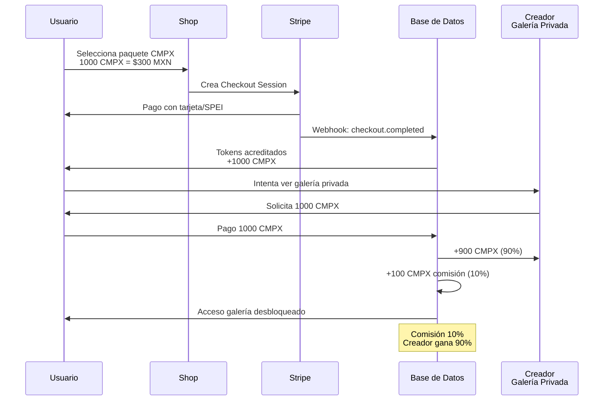
```mermaid
sequenceDiagram
    participant U as Usuario
    participant S as Shop
    participant ST as Stripe
    participant DB as Base de Datos
    participant C as Creador<br/>Galería Privada

    U->>S: Selecciona paquete CMPX<br/>1000 CMPX = $300 MXN
    S->>ST: Crea Checkout Session
    ST->>U: Pago con tarjeta/SPEI
    ST->>DB: Webhook: checkout.completed
    DB->>U: Tokens acreditados<br/>+1000 CMPX

    U->>C: Intenta ver galería privada
    C->>U: Solicita 1000 CMPX
    U->>DB: Pago 1000 CMPX
    DB->>C: +900 CMPX (90%)
    DB->>DB: +100 CMPX comisión (10%)
    DB->>U: Acceso galería desbloqueado

    Note over DB: Comisión 10%<br/>Creador gana 90%
```

---

## 💰 FLUJO DE DONATIVOS/INVERSIÓN

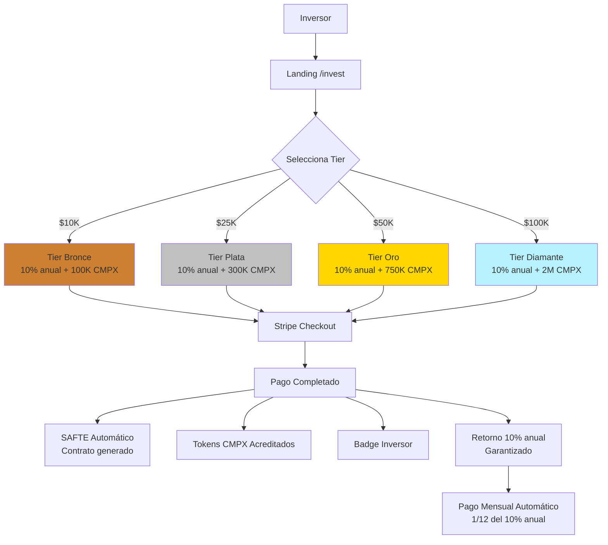
```mermaid
flowchart TD
    A[Inversor] --> B[Landing /invest]
    B --> C{Selecciona Tier}
    C -->|$10K| D[Tier Bronce<br/>10% anual + 100K CMPX]
    C -->|$25K| E[Tier Plata<br/>10% anual + 300K CMPX]
    C -->|$50K| F[Tier Oro<br/>10% anual + 750K CMPX]
    C -->|$100K| G[Tier Diamante<br/>10% anual + 2M CMPX]

    D --> H[Stripe Checkout]
    E --> H
    F --> H
    G --> H

    H --> I[Pago Completado]
    I --> J[SAFTE Automático<br/>Contrato generado]
    I --> K[Tokens CMPX Acreditados]
    I --> L[Badge Inversor]
    I --> M[Retorno 10% anual<br/>Garantizado]

    M --> N[Pago Mensual Automático<br/>1/12 del 10% anual]

    style D fill:#cd7f32
    style E fill:#c0c0c0
    style F fill:#ffd700
    style G fill:#b9f2ff
```

---

## 🤖 FLUJO DE IA COMPLICE (ASISTENTE PERSONAL)

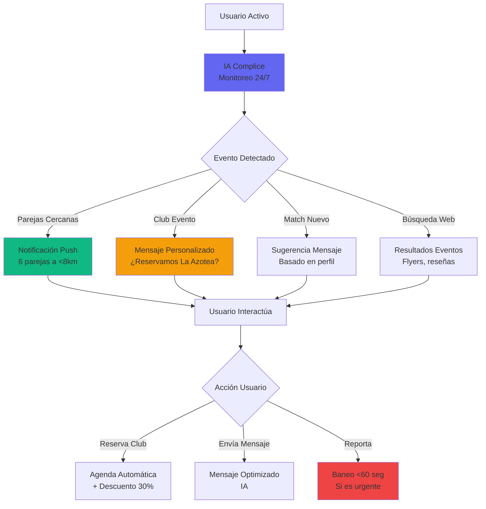
```mermaid
graph TB
    A[Usuario Activo] --> B[IA Complice<br/>Monitoreo 24/7]
    B --> C{Evento Detectado}
    C -->|Parejas Cercanas| D[Notificación Push<br/>6 parejas a <8km]
    C -->|Club Evento| E[Mensaje Personalizado<br/>¿Reservamos La Azotea?]
    C -->|Match Nuevo| F[Sugerencia Mensaje<br/>Basado en perfil]
    C -->|Búsqueda Web| G[Resultados Eventos<br/>Flyers, reseñas]

    D --> H[Usuario Interactúa]
    E --> H
    F --> H
    G --> H

    H --> I{Acción Usuario}
    I -->|Reserva Club| J[Agenda Automática<br/>+ Descuento 30%]
    I -->|Envía Mensaje| K[Mensaje Optimizado<br/>IA]
    I -->|Reporta| L[Baneo <60 seg<br/>Si es urgente]

    style B fill:#6366f1
    style D fill:#10b981
    style E fill:#f59e0b
    style L fill:#ef4444
```

---

## 🔐 FLUJO DE BANEO PERMANENTE

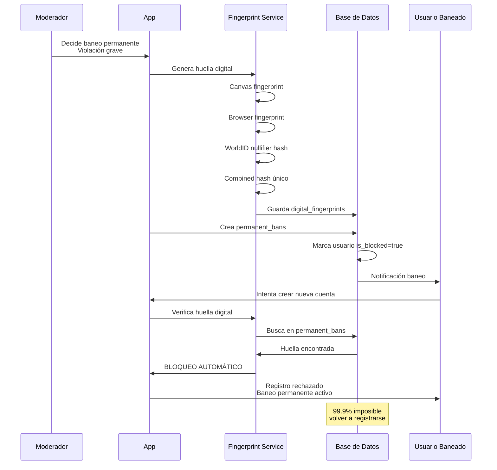
```mermaid
sequenceDiagram
    participant M as Moderador
    participant A as App
    participant FP as Fingerprint Service
    participant DB as Base de Datos
    participant U as Usuario Baneado

    M->>A: Decide baneo permanente<br/>Violación grave
    A->>FP: Genera huella digital
    FP->>FP: Canvas fingerprint
    FP->>FP: Browser fingerprint
    FP->>FP: WorldID nullifier hash
    FP->>FP: Combined hash único
    FP->>DB: Guarda digital_fingerprints

    A->>DB: Crea permanent_bans
    DB->>DB: Marca usuario is_blocked=true
    DB->>U: Notificación baneo

    U->>A: Intenta crear nueva cuenta
    A->>FP: Verifica huella digital
    FP->>DB: Busca en permanent_bans
    DB->>FP: Huella encontrada
    FP->>A: BLOQUEO AUTOMÁTICO
    A->>U: Registro rechazado<br/>Baneo permanente activo

    Note over DB: 99.9% imposible<br/>volver a registrarse
```

---

## 📊 FLUJO DE PAGOS AUTOMÁTICOS MODERADORES

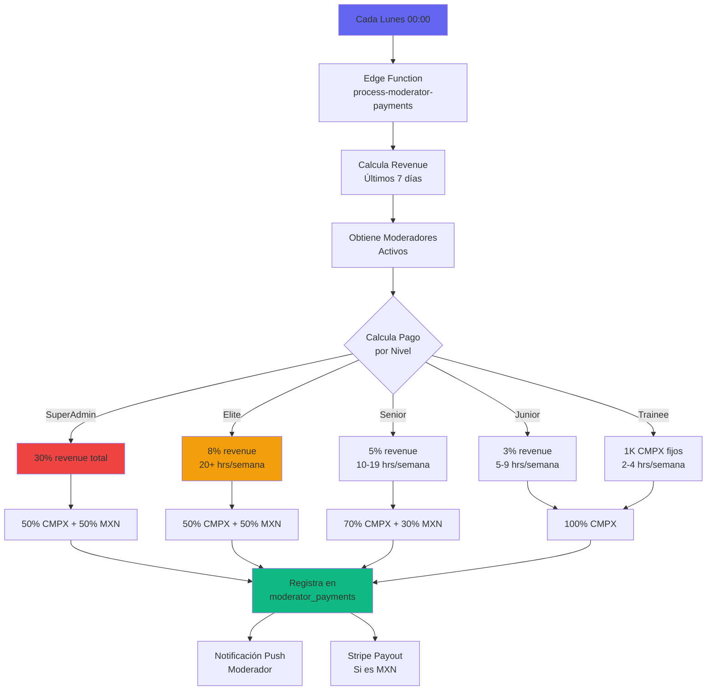
```mermaid
flowchart TD
    A[Cada Lunes 00:00] --> B[Edge Function<br/>process-moderator-payments]
    B --> C[Calcula Revenue<br/>Últimos 7 días]
    C --> D[Obtiene Moderadores<br/>Activos]
    D --> E{Calcula Pago<br/>por Nivel}

    E -->|SuperAdmin| F[30% revenue total]
    E -->|Elite| G[8% revenue<br/>20+ hrs/semana]
    E -->|Senior| H[5% revenue<br/>10-19 hrs/semana]
    E -->|Junior| I[3% revenue<br/>5-9 hrs/semana]
    E -->|Trainee| J[1K CMPX fijos<br/>2-4 hrs/semana]

    F --> K[50% CMPX + 50% MXN]
    G --> L[50% CMPX + 50% MXN]
    H --> M[70% CMPX + 30% MXN]
    I --> N[100% CMPX]
    J --> N

    K --> O[Registra en<br/>moderator_payments]
    L --> O
    M --> O
    N --> O

    O --> P[Notificación Push<br/>Moderador]
    O --> Q[Stripe Payout<br/>Si es MXN]

    style A fill:#6366f1
    style F fill:#ef4444
    style G fill:#f59e0b
    style O fill:#10b981
```

---

## 🏪 FLUJO DE PUBLICIDAD CLUBS

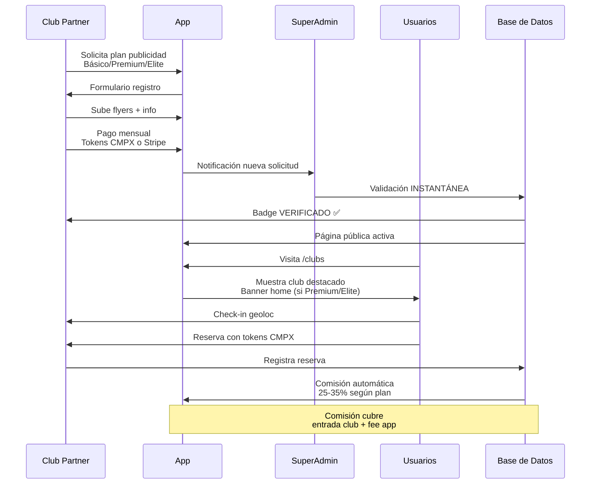
```mermaid
sequenceDiagram
    participant C as Club Partner
    participant A as App
    participant S as SuperAdmin
    participant U as Usuarios
    participant DB as Base de Datos

    C->>A: Solicita plan publicidad<br/>Básico/Premium/Elite
    A->>C: Formulario registro
    C->>A: Sube flyers + info
    C->>A: Pago mensual<br/>Tokens CMPX o Stripe
    A->>S: Notificación nueva solicitud
    S->>DB: Validación INSTANTÁNEA
    DB->>C: Badge VERIFICADO ✅
    DB->>A: Página pública activa

    U->>A: Visita /clubs
    A->>U: Muestra club destacado<br/>Banner home (si Premium/Elite)
    U->>C: Check-in geoloc
    U->>C: Reserva con tokens CMPX
    C->>DB: Registra reserva
    DB->>A: Comisión automática<br/>25-35% según plan

    Note over A,DB: Comisión cubre<br/>entrada club + fee app
```

---

## 📈 FLUJO DE CRECIMIENTO ORGÁNICO

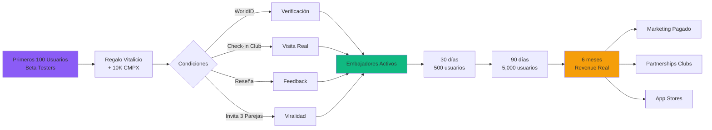
```mermaid
graph LR
    A[Primeros 100 Usuarios<br/>Beta Testers] --> B[Regalo Vitalicio<br/>+ 10K CMPX]
    B --> C{Condiciones}
    C -->|WorldID| D[Verificación]
    C -->|Check-in Club| E[Visita Real]
    C -->|Reseña| F[Feedback]
    C -->|Invita 3 Parejas| G[Viralidad]

    D --> H[Embajadores Activos]
    E --> H
    F --> H
    G --> H

    H --> I[30 días<br/>500 usuarios]
    I --> J[90 días<br/>5,000 usuarios]
    J --> K[6 meses<br/>Revenue Real]

    K --> L[Marketing Pagado]
    K --> M[Partnerships Clubs]
    K --> N[App Stores]

    style A fill:#8b5cf6
    style H fill:#10b981
    style K fill:#f59e0b
```

---

## 🔄 FLUJO DE STAKING CMPX

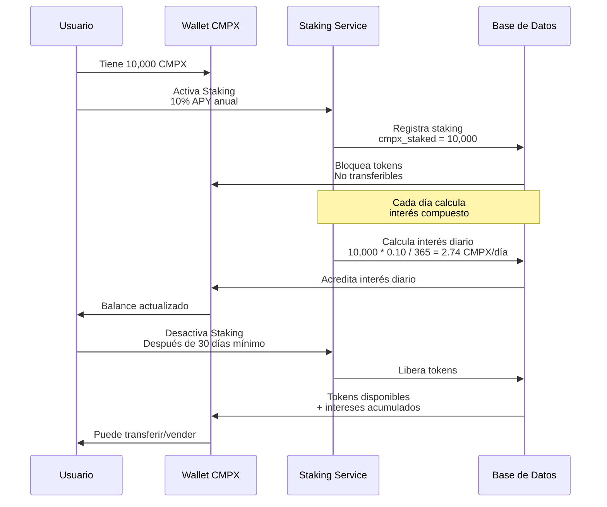
```mermaid
sequenceDiagram
    participant U as Usuario
    participant W as Wallet CMPX
    participant S as Staking Service
    participant DB as Base de Datos

    U->>W: Tiene 10,000 CMPX
    U->>S: Activa Staking<br/>10% APY anual
    S->>DB: Registra staking<br/>cmpx_staked = 10,000
    DB->>W: Bloquea tokens<br/>No transferibles

    Note over S,DB: Cada día calcula<br/>interés compuesto

    S->>DB: Calcula interés diario<br/>10,000 * 0.10 / 365 = 2.74 CMPX/día
    DB->>W: Acredita interés diario
    W->>U: Balance actualizado

    U->>S: Desactiva Staking<br/>Después de 30 días mínimo
    S->>DB: Libera tokens
    DB->>W: Tokens disponibles<br/>+ intereses acumulados
    W->>U: Puede transferir/vender
```

---

---

## 🔄 FLUJO DE ALINEACIÓN DE BASE DE DATOS v3.6.3

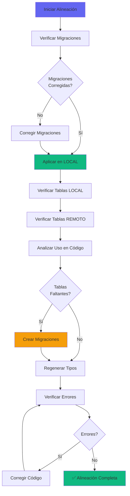
```mermaid
flowchart TD
    A[Iniciar Alineación] --> B[Verificar Migraciones]
    B --> C{Migraciones<br/>Corregidas?}
    C -->|Sí| D[Aplicar en LOCAL]
    C -->|No| E[Corregir Migraciones]
    E --> D
    D --> F[Verificar Tablas LOCAL]
    F --> G[Verificar Tablas REMOTO]
    G --> H[Analizar Uso en Código]
    H --> I{Tablas<br/>Faltantes?}
    I -->|Sí| J[Crear Migraciones]
    I -->|No| K[Regenerar Tipos]
    J --> K
    K --> L[Verificar Errores]
    L --> M{Errores?}
    M -->|Sí| N[Corregir Código]
    M -->|No| O[✅ Alineación Completa]
    N --> L

    style A fill:#6366f1
    style D fill:#10b981
    style J fill:#f59e0b
    style O fill:#10b981
```

---

## 🚀 FLUJO DE DEPLOYMENT VERCEL v3.6.3

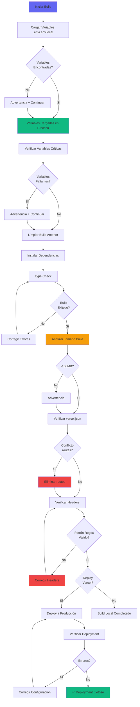
```mermaid
flowchart TD
    A[Iniciar Build] --> B[Cargar Variables .env/.env.local]
    B --> C{Variables<br/>Encontradas?}
    C -->|Sí| D[Variables Cargadas en Proceso]
    C -->|No| E[Advertencia + Continuar]
    E --> D
    D --> F[Verificar Variables Críticas]
    F --> G{Variables<br/>Faltantes?}
    G -->|Sí| H[Advertencia + Continuar]
    G -->|No| I[Limpiar Build Anterior]
    H --> I
    I --> J[Instalar Dependencias]
    J --> K[Type Check]
    K --> L{Build<br/>Exitoso?}
    L -->|No| M[Corregir Errores]
    M --> K
    L -->|Sí| N[Analizar Tamaño Build]
    N --> O{< 60MB?}
    O -->|No| P[Advertencia]
    O -->|Sí| Q[Verificar vercel.json]
    P --> Q
    Q --> R{Conflicto<br/>routes?}
    R -->|Sí| S[Eliminar routes]
    R -->|No| T[Verificar Headers]
    S --> T
    T --> U{Patrón Regex<br/>Válido?}
    U -->|No| V[Corregir Headers]
    U -->|Sí| W{Deploy<br/>Vercel?}
    V --> T
    W -->|Sí| X[Deploy a Producción]
    W -->|No| Y[Build Local Completado]
    X --> Z[Verificar Deployment]
    Z --> AA{Errores?}
    AA -->|Sí| AB[Corregir Configuración]
    AB --> X
    AA -->|No| AC[✅ Deployment Exitoso]

    style A fill:#6366f1
    style D fill:#10b981
    style N fill:#f59e0b
    style AC fill:#10b981
    style S fill:#ef4444
    style V fill:#ef4444
```

---

**Documento creado:** 06 Noviembre 2025  
**Última actualización:** 15 Noviembre 2025  
**Versión:** 1.4

### 🚀 Cambios v3.6.4 (15 Nov 2025)

- ✅ **FLUJO COMPLETO DE USUARIO actualizado** con ruta `/demo`
- ✅ **Selector de cuentas demo** (Single/Pareja) implementado
- ✅ **Validación de teléfono MX** integrada en onboarding
  - Soporte formatos: 5512345678, 044/045, +52, etc.
  - Normalización automática a +52XXXXXXXXXX
  - Validación de códigos de área mexicanos
- ✅ **Navegación condicional** basada en estado de perfil
- ✅ **PhoneInput component** con validación en tiempo real
- ✅ **Auto-formato visual** de número telefónico
- ✅ Diagrama muestra flujo Demo vs Registro Real
- ✅ Integración completa teléfono en proceso de registro

### 🚀 Cambios v3.6.3 (09 Nov 2025)

- ✅ Flujo de deployment Vercel actualizado con verificación de `vercel.json`
- ✅ Detección de conflictos `routes` vs `rewrites`/`headers`
- ✅ Validación de patrones regex en headers
- ✅ Carga automática de variables desde `.env`/`.env.local`
- ✅ Funciones globales `showEnvInfo()` y `showErrorReport()` disponibles en producción
- ✅ CircleCI configurado con Node.js 20.19+ (requerido por Vite 7.2.2)

--- END FILE: DIAGRAMAS_FLUJOS_v3.0.md ---

--- BEGIN FILE: DIAGRAMAS_FLUJOS_v3.5.0.md ---

# 📊 DIAGRAMAS DE FLUJOS v3.8.0 - COMPLICESCONECTA v3.8.0

**Fecha:** 26 Diciembre 2025
**Versión:** 3.8.0
**Estado:** ✅ PRIVACY ENHANCED - UI POLISHED - CODE STANDARDIZED

---

## 🔄 FLUJO COMPLETO DE USUARIO (Actualizado v3.7.0)

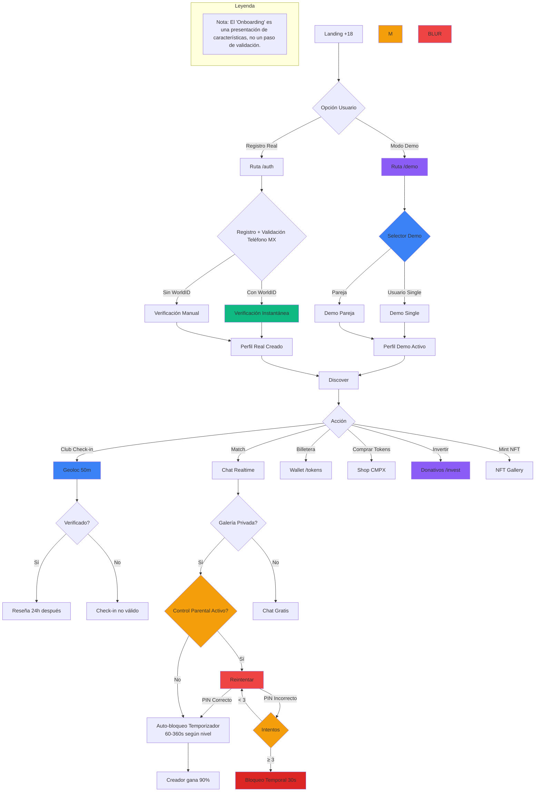
```mermaid
flowchart TD
    A[Landing +18] --> B{Opción Usuario}
    B -->|Modo Demo| C[Ruta /demo]
    B -->|Registro Real| D[Ruta /auth]

    C --> E{Selector Demo}
    E -->|Usuario Single| F[Demo Single]
    E -->|Pareja| G[Demo Pareja]

    F --> H[Perfil Demo Activo]
    G --> H

    D --> I{Registro + Validación Teléfono MX}
    I -->|Con WorldID| J[Verificación Instantánea]
    I -->|Sin WorldID| K[Verificación Manual]

    J --> O[Perfil Real Creado]
    K --> O

    subgraph Leyenda
        direction LR
        Note1[Nota: El 'Onboarding' es una presentación de características, no un paso de validación.]
    end

    H --> P[Discover]
    O --> P

    P --> Q{Acción}
    Q -->|Match| R[Chat Realtime]
    Q -->|Club Check-in| S[Geoloc 50m]
    Q -->|Billetera| WT[Wallet /tokens]
    Q -->|Comprar Tokens| T[Shop CMPX]
    Q -->|Invertir| U[Donativos /invest]
    Q -->|Mint NFT| N1[NFT Gallery]

    S --> V{Verificado?}
    V -->|Sí| W[Reseña 24h después]
    V -->|No| X[Check-in no válido]

    R --> Y{Galería Privada?}
    Y -->|Sí| Z{Control Parental Activo?}
    Z -->|Sí| PC[Panel PIN de Desbloqueo<br/>Niveles: Soft/Medium/Strict]
    PC -->|PIN Correcto| Z2[Auto-bloqueo Temporizador<br/>60-360s según nivel]
    Z2 --> AB[Creador gana 90%]
    Z -->|No| Z2
    Y -->|No| AA[Chat Gratis]

    PC -->|PIN Incorrecto| PC2{Intentos}
    PC2 -->|< 3| PC[Reintentar]
    PC2 -->|≥ 3| PC3[Bloqueo Temporal 30s]

    style PC fill:#ef4444
    style PC2 fill:#f59e0b
    style PC3 fill:#dc2626

    style C fill:#8b5cf6
    style E fill:#3b82f6
    style J fill:#10b981
    style M fill:#f59e0b
    style S fill:#3b82f6
    style Z fill:#f59e0b
    style U fill:#8b5cf6
    style BLUR fill:#ef4444
```

---

## 🏢 FLUJO DE VERIFICACIÓN DE CLUB

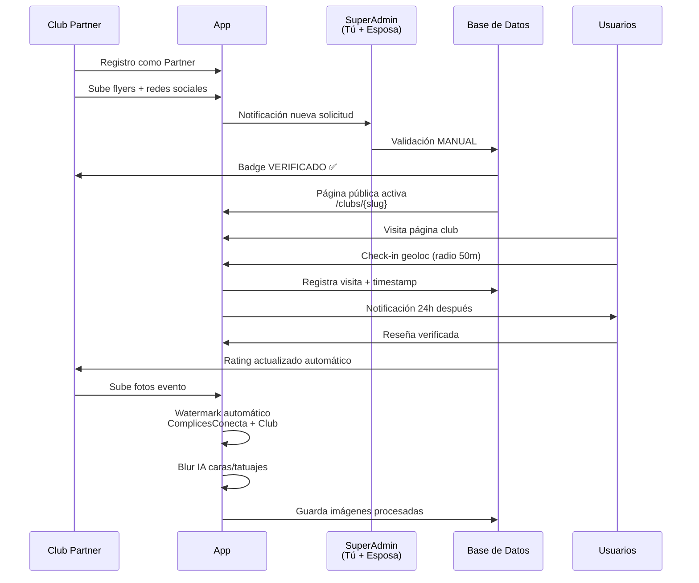
```mermaid
sequenceDiagram
    participant C as Club Partner
    participant A as App
    participant S as SuperAdmin<br/>(Tú + Esposa)
    participant DB as Base de Datos
    participant U as Usuarios

    C->>A: Registro como Partner
    C->>A: Sube flyers + redes sociales
    A->>S: Notificación nueva solicitud
    S->>DB: Validación MANUAL
    DB->>C: Badge VERIFICADO ✅
    DB->>A: Página pública activa<br/>/clubs/{slug}

    U->>A: Visita página club
    U->>A: Check-in geoloc (radio 50m)
    A->>DB: Registra visita + timestamp
    A->>U: Notificación 24h después
    U->>A: Reseña verificada
    DB->>C: Rating actualizado automático

    C->>A: Sube fotos evento
    A->>A: Watermark automático<br/>ComplicesConecta + Club
    A->>A: Blur IA caras/tatuajes
    A->>DB: Guarda imágenes procesadas
```

---

## 🛡️ FLUJO DE MODERACIÓN COMPLETO

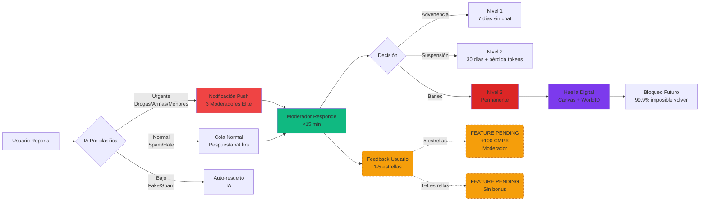
```mermaid
flowchart LR
    A[Usuario Reporta] --> B{IA Pre-clasifica}
    B -->|Urgente<br/>Drogas/Armas/Menores| C[Notificación Push<br/>3 Moderadores Elite]
    B -->|Normal<br/>Spam/Hate| D[Cola Normal<br/>Respuesta <4 hrs]
    B -->|Bajo<br/>Fake/Spam| E[Auto-resuelto<br/>IA]

    C --> F[Moderador Responde<br/><15 min]
    D --> F
    F --> G{Decisión}
    G -->|Advertencia| H[Nivel 1<br/>7 días sin chat]
    G -->|Suspensión| I[Nivel 2<br/>30 días + pérdida tokens]
    G -->|Baneo| J[Nivel 3<br/>Permanente]

    J --> K[Huella Digital<br/>Canvas + WorldID]
    K --> L[Bloqueo Futuro<br/>99.9% imposible volver]

    F --> M(Feedback Usuario<br/>1-5 estrellas)
    M -.->|5 estrellas| N(FEATURE PENDING<br/>+100 CMPX<br/>Moderador)
    M -.->|1-4 estrellas| O(FEATURE PENDING<br/>Sin bonus)

    style M fill:#f59e0b,stroke:#b45309,stroke-dasharray: 5 5
    style N fill:#f59e0b,stroke:#b45309,stroke-dasharray: 5 5
    style O fill:#f59e0b,stroke:#b45309,stroke-dasharray: 5 5

    style C fill:#ef4444
    style F fill:#10b981
    style J fill:#dc2626
    style K fill:#7c3aed
```

---

## 💎 FLUJO DE COMPRA Y USO DE TOKENS CMPX

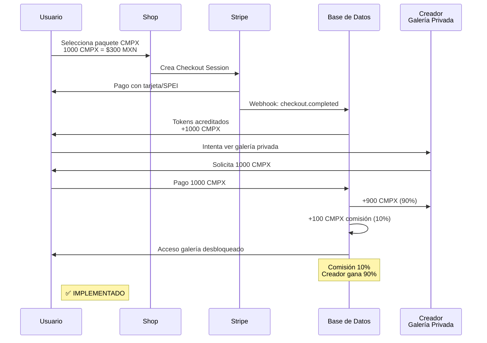
```mermaid
sequenceDiagram
    participant U as Usuario
    participant S as Shop
    participant ST as Stripe
    participant DB as Base de Datos
    participant C as Creador<br/>Galería Privada

    U->>S: Selecciona paquete CMPX<br/>1000 CMPX = $300 MXN
    S->>ST: Crea Checkout Session
    ST->>U: Pago con tarjeta/SPEI
    ST->>DB: Webhook: checkout.completed
    DB->>U: Tokens acreditados<br/>+1000 CMPX

    U->>C: Intenta ver galería privada
    C->>U: Solicita 1000 CMPX
    U->>DB: Pago 1000 CMPX
    DB->>C: +900 CMPX (90%)
    DB->>DB: +100 CMPX comisión (10%)
    DB->>U: Acceso galería desbloqueado

    Note over DB: Comisión 10%<br/>Creador gana 90%
    Note right of U: ✅ IMPLEMENTADO
```

---

## 💰 FLUJO DE DONATIVOS/INVERSIÓN

```mermaid
flowchart TD
    A[Inversor] --> B[Landing /invest]
    B --> C{Selecciona Tier}
    C -->|$10K| D[Tier Bronce<br/>10% anual + 100K CMPX]
    C -->|$25K| E[Tier Plata<br/>10% anual + 300K CMPX]
    C -->|$50K| F[Tier Oro<br/>10% anual + 750K CMPX]
    C -->|$100K| G[Tier Diamante<br/>10% anual + 2M CMPX]

    D --> H[Stripe Checkout]
    E --> H
    F --> H
    G --> H

    H --> I[Pago Completado]
    I --> J[SAFTE Automático<br/>Contrato generado]
    I --> K[Tokens CMPX Acreditados]
    I --> L[Badge Inversor]
    I --> M[Retorno 10% anual<br/>Garantizado]

    M --> N[Pago Mensual Automático<br/>1/12 del 10% anual]

    style D fill:#cd7f32
    style E fill:#c0c0c0
    style F fill:#ffd700
    style G fill:#b9f2ff
```

---

## 🤖 FLUJO DE IA COMPLICE (ASISTENTE PERSONAL)

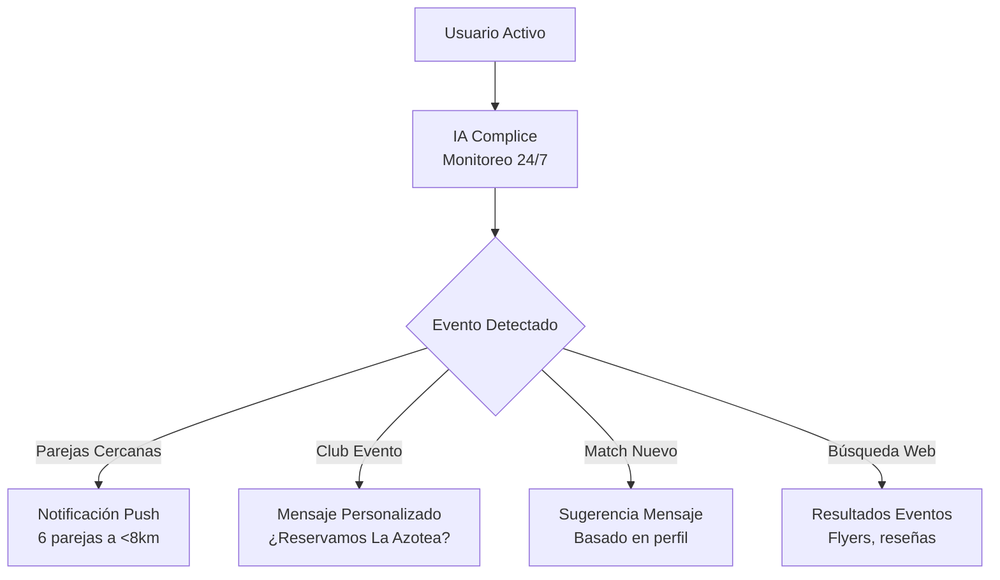
```mermaid
graph TB
    A[Usuario Activo] --> B[IA Complice<br/>Monitoreo 24/7]
    B --> C{Evento Detectado}
    C -->|Parejas Cercanas| D[Notificación Push<br/>6 parejas a <8km]
    C -->|Club Evento| E[Mensaje Personalizado<br/>¿Reservamos La Azotea?]
    C -->|Match Nuevo| F[Sugerencia Mensaje<br/>Basado en perfil]
    C -->|Búsqueda Web| G[Resultados Eventos<br/>Flyers, reseñas]
```

---

### 🧩 Notas de Arquitectura de UI (v3.8.0)

graph TD
%% Lógica de Navegación Condicional
User[Usuario Navega] --> Router{¿Qué Ruta es?}

    %% Flujo Público
    Router -->|Ruta Pública / Landing| PublicLayout[Layout Público]
    PublicLayout --> ShowHeader[✅ MOSTRAR: HeaderNav]
    PublicLayout --> HideTabs[❌ OCULTAR: ProfileNavTabs]

    %% Flujo Privado (Perfiles)
    Router -->|Ruta Privada /profile| ProfileLayout[Layout Perfil]
    ProfileLayout --> HideHeader[❌ OCULTAR: HeaderNav]
    ProfileLayout --> ShowTabs[✅ MOSTRAR: ProfileNavTabs]

    %% Lógica del Botón de Login (Global)
    ShowHeader & ShowTabs --> AuthCheck{¿Autenticado?}
    AuthCheck -->|No| BtnLogin[Mostrar Botón: 'Iniciar Sesión']
    AuthCheck -->|Sí| BtnUser[Mostrar Botón: 'Nombre/Nickname']

    %% Estilos
    style PublicLayout fill:#e1f5fe,stroke:#01579b
    style ProfileLayout fill:#fff3e0,stroke:#e65100
    style HideHeader fill:#ffcdd2,stroke:#b71c1c
    style ShowTabs fill:#c8e6c9,stroke:#1b5e20

sequenceDiagram
participant User as Usuario
participant UI as Interfaz
participant Logic as Permisos

    User->>UI: Click en Imagen de Galería
    UI->>Logic: ¿Tiene Permiso de Visualización?

    alt Es VIP o Dueño
        Logic-->>UI: Acceso Total
        UI->>UI: Abrir Lightbox (Sin Blur)
    else Usuario Gratuito / No Match
        Logic-->>UI: Acceso Restringido
        UI->>UI: Abrir Lightbox + APLICAR BLUR (CSS filter)
        UI->>User: Mostrar Overlay "Desbloquear Foto"
        User->>UI: Click "Desbloquear"
        UI->>Logic: Procesar Pago/Token
        Logic-->>UI: Retirar Blur
    end

    sequenceDiagram
    participant User as Usuario
    participant UI as Interfaz
    participant Logic as Permisos

    User->>UI: Click en Imagen de Galería
    UI->>Logic: ¿Tiene Permiso de Visualización?

    alt Es VIP o Dueño
        Logic-->>UI: Acceso Total
        UI->>UI: Abrir Lightbox (Sin Blur)
    else Usuario Gratuito / No Match
        Logic-->>UI: Acceso Restringido
        UI->>UI: Abrir Lightbox + APLICAR BLUR (CSS filter)
        UI->>User: Mostrar Overlay "Desbloquear Foto"
        User->>UI: Click "Desbloquear"
        UI->>Logic: Procesar Pago/Token
        Logic-->>UI: Retirar Blur
    end

- ## Todos los flujos descritos se renderizan ahora bajo un **MainLayout** unificado que controla:
  - ## El sistema de fondos (`UnifiedBackground` + partículas híbridas) con gradientes nocturnos tipo Plexus.
  - ## La navegación global fija (`AppSidebar` + header) para evitar barras duplicadas por página.
- ## Las páginas de **Tokens**, **NFTs**, **Perfil Single** y **Settings** adoptan glassmorphism consistente para las cards principales, mientras que las sub-cards (proyecciones, ventajas, condiciones) usan un patrón glass ligero para marcar jerarquías visuales.
- ## Se añade un **Centro de Control IA** (`/ai-help`) como vista dedicada donde se explica al usuario qué es CómplicesConecta, cómo funciona la IA Local sobre WebLLM (modelo Phi‑3‑mini ejecutado en el navegador) y cómo se aplican las reglas legales del Libro Maestro (`app-master-context.md`). Desde esta página, el usuario puede interactuar con el Asistente IA Legal antes de firmar contratos o realizar operaciones con tokens/NFTs.

# Flujo de Funcionalidad NFT - CómplicesConecta

## 1. Descripción General

El sistema de NFTs permite a los usuarios (singles y parejas) "mintear" (crear) tokens no fungibles que representan contenido exclusivo o identidad en la blockchain de Polygon.

## 2. Componente Principal

`NFTMintButton` (`src/components/blockchain/NFTMintButton.tsx`)

### Props

- `userId`: ID del usuario.
- `type`: 'single' | 'couple'.
- `nftName`: Nombre del activo.
- `nftDescription`: Descripción.
- `imageFile`: Archivo a mintear.
- `partnerEmail`: (Requerido para 'couple').

## 3. Lógica de Negocio

### Validaciones

- **Tamaño de archivo:** Máximo 5MB.
- **Formato:** JPG, PNG, WEBP.
- **Parejas:** Requiere email de la pareja para flujo de doble consentimiento.

### Modos de Operación

1. **Modo Demo:**
   - Simula la transacción sin costo.
   - Retorna un `tokenId` simulado.
   - No interactúa con la blockchain real.
   - Ideal para pruebas y desarrollo.

2. **Modo Producción:**
   - Interactúa con `WalletService` y `NFTService`.
   - **Single:** Minteo directo.
   - **Couple:** Crea una solicitud de firma pendiente. La pareja debe aprobar.

## 4. Flujo de Usuario

1. Usuario selecciona imagen en Galería.
2. Clic en "Mintear NFT".
3. Se valida el archivo.
4. Feedback visual (Loading/Spinner).
5. **Éxito:**
   - Single: Mensaje "NFT Minteado".
   - Couple: Mensaje "Solicitud enviada a pareja".
6. **Error:**
   - Mensaje descriptivo (e.g., "Archivo muy grande").

## 5. Pruebas

## "Arquitectura UI"

A. Nuevo Flujo de Navegación (Header vs Tabs)

graph TD
%% Lógica de Navegación Condicional
User[Usuario Navega] --> Router{¿Qué Ruta es?}

    %% Flujo Público
    Router -->|Ruta Pública / Landing| PublicLayout[Layout Público]
    PublicLayout --> ShowHeader[✅ MOSTRAR: HeaderNav]
    PublicLayout --> HideTabs[❌ OCULTAR: ProfileNavTabs]

    %% Flujo Privado (Perfiles)
    Router -->|Ruta Privada /profile| ProfileLayout[Layout Perfil]
    ProfileLayout --> HideHeader[❌ OCULTAR: HeaderNav]
    ProfileLayout --> ShowTabs[✅ MOSTRAR: ProfileNavTabs]

    %% Lógica del Botón de Login (Global)
    ShowHeader & ShowTabs --> AuthCheck{¿Autenticado?}
    AuthCheck -->|No| BtnLogin[Mostrar Botón: 'Iniciar Sesión']
    AuthCheck -->|Sí| BtnUser[Mostrar Botón: 'Nombre/Nickname']

    %% Estilos
    style PublicLayout fill:#e1f5fe,stroke:#01579b
    style ProfileLayout fill:#fff3e0,stroke:#e65100
    style HideHeader fill:#ffcdd2,stroke:#b71c1c
    style ShowTabs fill:#c8e6c9,stroke:#1b5e20

B. Nuevo Flujo de Galería (Lógica del Blur)

## "Flujos de Usuario":

sequenceDiagram
participant User as Usuario
participant UI as Interfaz
participant Logic as Permisos

    User->>UI: Click en Imagen de Galería
    UI->>Logic: ¿Tiene Permiso de Visualización?

    alt Es VIP o Dueño
        Logic-->>UI: Acceso Total
        UI->>UI: Abrir Lightbox (Sin Blur)
    else Usuario Gratuito / No Match
        Logic-->>UI: Acceso Restringido
        UI->>UI: Abrir Lightbox + APLICAR BLUR (CSS filter)
        UI->>User: Mostrar Overlay "Desbloquear Foto"
        User->>UI: Click "Desbloquear"
        UI->>Logic: Procesar Pago/Token
        Logic-->>UI: Retirar Blur
    end

## "Flujo de Creación de NFT (El Botón Perdido)"

    graph LR
    %% Flujo de Creación
    Start((Inicio)) --> BtnCreate[Click: Botón 'Crear NFT']
    BtnCreate --> Upload{¿Subir o Seleccionar?}
    Upload -->|Galería| Select[Seleccionar de Galería Existente]
    Upload -->|Nuevo| Camera[Subir Foto Nueva]

    Select & Camera --> Preview[Vista Previa NFT]
    Preview --> Mint[Ejecutar Minting en Blockchain]
    Mint --> Wallet[Interacción Wallet]
    Wallet -->|Confirmado| Success[✨ NFT Creado en Perfil]

## "Arquitectura UI"

A. Nuevo Flujo de Navegación (Header vs Tabs)

graph TD
%% Lógica de Navegación Condicional
User[Usuario Navega] --> Router{¿Qué Ruta es?}

    %% Flujo Público
    Router -->|Ruta Pública / Landing| PublicLayout[Layout Público]
    PublicLayout --> ShowHeader[✅ MOSTRAR: HeaderNav]
    PublicLayout --> HideTabs[❌ OCULTAR: ProfileNavTabs]

    %% Flujo Privado (Perfiles)
    Router -->|Ruta Privada /profile| ProfileLayout[Layout Perfil]
    ProfileLayout --> HideHeader[❌ OCULTAR: HeaderNav]
    ProfileLayout --> ShowTabs[✅ MOSTRAR: ProfileNavTabs]

    %% Lógica del Botón de Login (Global)
    ShowHeader & ShowTabs --> AuthCheck{¿Autenticado?}
    AuthCheck -->|No| BtnLogin[Mostrar Botón: 'Iniciar Sesión']
    AuthCheck -->|Sí| BtnUser[Mostrar Botón: 'Nombre/Nickname']

    %% Estilos
    style PublicLayout fill:#e1f5fe,stroke:#01579b
    style ProfileLayout fill:#fff3e0,stroke:#e65100
    style HideHeader fill:#ffcdd2,stroke:#b71c1c
    style ShowTabs fill:#c8e6c9,stroke:#1b5e20

## "Flujos de Usuario"

B. Nuevo Flujo de Galería (Lógica del Blur)

sequenceDiagram
participant User as Usuario
participant UI as Interfaz
participant Logic as Permisos

    User->>UI: Click en Imagen de Galería
    UI->>Logic: ¿Tiene Permiso de Visualización?

    alt Es VIP o Dueño
        Logic-->>UI: Acceso Total
        UI->>UI: Abrir Lightbox (Sin Blur)
    else Usuario Gratuito / No Match
        Logic-->>UI: Acceso Restringido
        UI->>UI: Abrir Lightbox + APLICAR BLUR (CSS filter)
        UI->>User: Mostrar Overlay "Desbloquear Foto"
        User->>UI: Click "Desbloquear"
        UI->>Logic: Procesar Pago/Token
        Logic-->>UI: Retirar Blur
    end

## "Economía y Tokens"

C. Flujo de Creación de NFT (El Botón Perdido)

graph LR
%% Flujo de Creación
Start((Inicio)) --> BtnCreate[Click: Botón 'Crear NFT']
BtnCreate --> Upload{¿Subir o Seleccionar?}
Upload -->|Galería| Select[Seleccionar de Galería Existente]
Upload -->|Nuevo| Camera[Subir Foto Nueva]

    Select & Camera --> Preview[Vista Previa NFT]
    Preview --> Mint[Ejecutar Minting en Blockchain]
    Mint --> Wallet[Interacción Wallet]
    Wallet -->|Confirmado| Success[✨ NFT Creado en Perfil]

---

## 🔒 FLUJO DE CONTROL PARENTAL EN GALERÍA PRIVADA

```mermaid
flowchart TD
    A[Usuario Click en Galería Privada] --> B{Control Parental Activo?}
    B -->|No| C[Mostrar Imágenes Directamente]
    B -->|Sí| D[Panel de Bloqueo]
    
    D --> E{Usuario Click Desbloquear}
    E --> F[Input PIN de 4 dígitos]
    F --> G{PIN Correcto?}
    
    G -->|Sí| H{Nivel de Restricción}
    H -->|Soft| I[Auto-bloqueo en 360s]
    H -->|Medium| J[Auto-bloqueo en 180s]
    H -->|Strict| K[Auto-bloqueo en 60s]
    
    I --> L[Mostrar Imágenes]
    J --> L
    K --> L
    
    L --> M[Temporizador Visible]
    M --> N{Tiempo Agotado?}
    N -->|Sí| D
    N -->|No| L
    
    G -->|No| O{Intentos}
    O -->|< 3| F
    O -->|≥ 3| P[Bloqueo Temporal 30s]
    P --> Q[Esperar 30s]
    Q --> F
    
    style D fill:#ef4444
    style P fill:#dc2626
    style I fill:#10b981
    style J fill:#f59e0b
    style K fill:#ef4444
    style L fill:#8b5cf6
```

**Componente:** `src/components/profiles/shared/ParentalControl.tsx`

**Características:**
- **Niveles de restricción:** Soft (360s), Medium (180s), Strict (60s)
- **PIN de 4 dígitos:** Por defecto "1234", configurable
- **Bloqueo temporal:** 30 segundos después de 3 intentos fallidos
- **Auto-bloqueo:** Temporizador visible que reactiva el bloqueo
- **Persistencia:** Estado guardado en localStorage

**Integración en ProfileSingle.tsx:**
- Importado y usado en sección de galería privada
- Estado `isParentalLocked` sincronizado con localStorage
- Toggle manual disponible para activar/desactivar control parental

---

## 🏢 FLUJO COMPLETO DE CLUB PROFILES

```mermaid
flowchart TD
    A[Club Partner] --> B[Formulario de Registro<br/>/clubs/apply]
    B --> C[Datos Propietario<br/>Nombre, RFC, Género, Edad]
    C --> D[Datos Representante<br/>Opcional]
    D --> E[Datos del Club<br/>Nombre, Dirección, Teléfono]
    E --> F[Detalles del Club<br/>Descripción, Tipo, Horarios]
    F --> G[Documentos<br/>URL Google Drive/Dropbox]
    G --> H{Validación}
    
    H -->|Datos Incompletos| B
    H -->|Datos Completos| I[Guardar en BD<br/>club_applications]
    I --> J[Enviar Email<br/>complicesconectasw@outlook.es]
    J --> K[Estado: Pending]
    
    K --> L{Revisión Admin}
    L -->|Aprobar| M[Crear Perfil Demo<br/>/clubs/{slug}]
    L -->|Rechazar| N[Enviar Razón]
    L -->|Revisar| O[Solicitar Más Info]
    
    M --> P[Perfil Demo Activo]
    P --> Q[Panel de Administración<br/>Solo Dueño]
    
    Q --> R[Editar Perfil]
    Q --> S[Subir Contenido<br/>Fotos/Videos]
    Q --> T[Crear Eventos]
    Q --> U[Gestionar Promociones]
    Q --> V[Configurar Descuentos]
    Q --> W[Ver Analytics]
    
    V --> X{Tipo de Descuento}
    X -->|CMPX| Y[10% Entrada<br/>20% Bebidas<br/>15% VIP]
    X -->|GTK Holders| Z[25% Entrada<br/>30% Bebidas<br/>50% VIP]
    X -->|Premium| AA[30% Entrada<br/>40% Bebidas<br/>60% VIP]
    
    P --> AB[Usuario Visita Perfil]
    AB --> AC{Acción Usuario}
    
    AC -->|Check-in| AD[Geolocalización 50m]
    AD --> AE{Dentro del Radio?}
    AE -->|Sí| AF[Check-in Exitoso]
    AE -->|No| AG[Check-in Rechazado]
    
    AF --> AH{Puede Reseñar?}
    AH -->|24h después| AI[Crear Reseña]
    AH -->|No| AJ[Esperar 24h]
    
    AC -->|Ver Galería| AK[Fotos/Videos]
    AC -->|Ver Eventos| AL[Calendario]
    AC -->|Usar Descuento| AM{Tokens Disponibles?}
    
    AM -->|Sí| AN[Aplicar Descuento]
    AM -->|No| AO[Comprar Tokens]
    
    AI --> AP[Rating Actualizado]
    AN --> AQ[Pago con Tokens]
    AQ --> AR[Transacción Blockchain]
    
    P --> AS[NFTs del Club]
    AS --> AT[Crear NFT]
    AT --> AU[Mercado Secundario]
    AU --> AV[Staking de NFTs]
    
    W --> AW[Analytics Dashboard]
    AW --> AX[Visitas por Día]
    AW --> AY[Check-ins por Semana]
    AW --> AZ[Engagement]
    AW --> BA[Demografía Visitantes]
    
    style B fill:#8b5cf6
    style I fill:#10b981
    style K fill:#f59e0b
    style M fill:#22c55e
    style N fill:#ef4444
    style P fill:#3b82f6
    style Q fill:#8b5cf6
    style Y fill:#f59e0b
    style Z fill:#ec4899
    style AA fill:#a855f7
    style AF fill:#22c55e
    style AG fill:#ef4444
    style AN fill:#22c55e
    style AR fill:#8b5cf6
    style AV fill:#f59e0b
```

**Componentes Principales:**
- `/src/pages/clubs/ClubProfile.tsx` - Perfil principal del club
- `/src/components/clubs/ClubProfileHeader.tsx` - Header con logo y rating
- `/src/components/clubs/ClubProfileGallery.tsx` - Galería multimedia
- `/src/components/clubs/ClubProfileEvents.tsx` - Calendario de eventos
- `/src/components/clubs/ClubProfileReviews.tsx` - Sistema de reseñas
- `/src/components/clubs/ClubProfileAdmin.tsx` - Panel de administración

**Tablas de Base de Datos:**
- `club_applications` - Solicitudes de registro
- `club_profiles` - Perfiles de clubs verificados
- `club_events` - Eventos del club
- `club_discounts` - Descuentos ofrecidos
- `club_check_ins` - Check-ins de usuarios
- `club_reviews` - Reseñas verificadas
- `club_nfts` - NFTs del club
- `club_followers` - Usuarios que siguen clubs

**Flujo de Descuentos:**
1. Usuario selecciona descuento → Verifica balance de tokens
2. Club acepta tipo de token → Aplica descuento
3. Pago procesado → Transacción registrada en blockchain
4. Usuario recibe confirmación → Descuento aplicado

**Roadmap de Implementación:**
- Fase 1 (Semana 1-2): Preparación - Tablas y migraciones
- Fase 2 (Semana 3-4): Perfil Demo - UI básica y check-ins
- Fase 3 (Semana 5-6): Panel Admin - Edición y gestión
- Fase 4 (Semana 7-8): Tokens y NFTs - Integración blockchain
- Fase 5 (Semana 9-10): Testing y Lanzamiento - QA y beta

**Lanzamiento Estimado:** Q2 2026

--- END FILE: DIAGRAMAS_FLUJOS_v3.5.0.md ---
