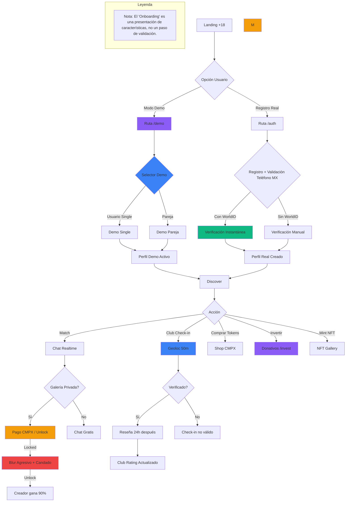
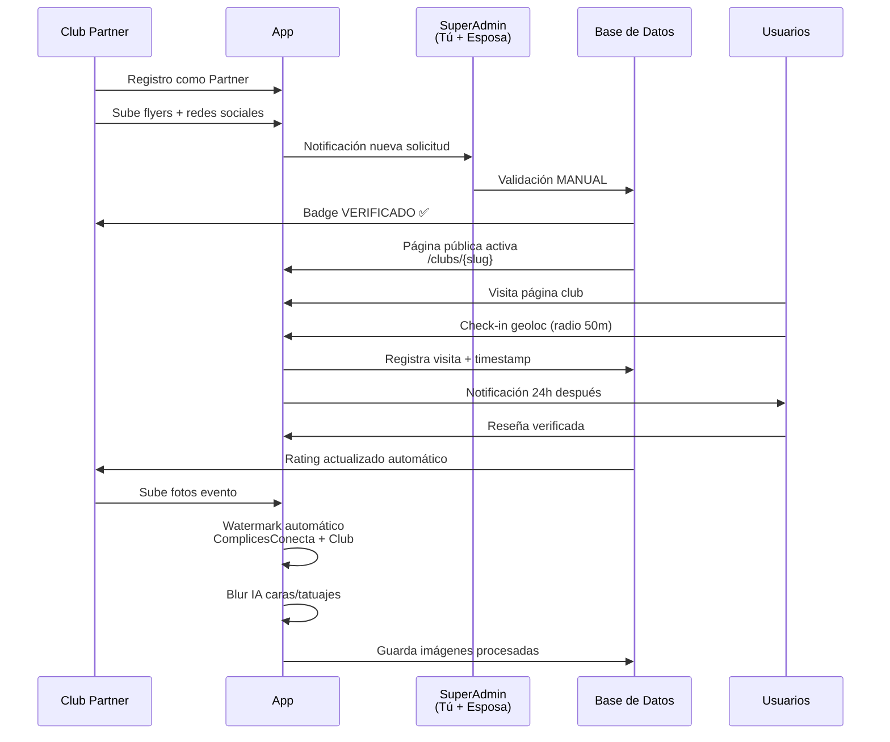
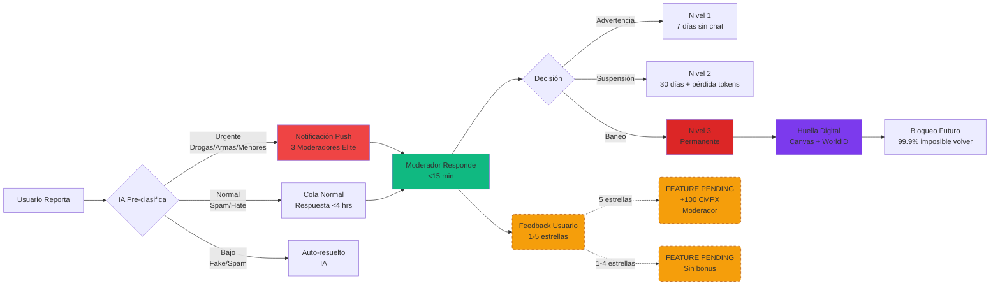
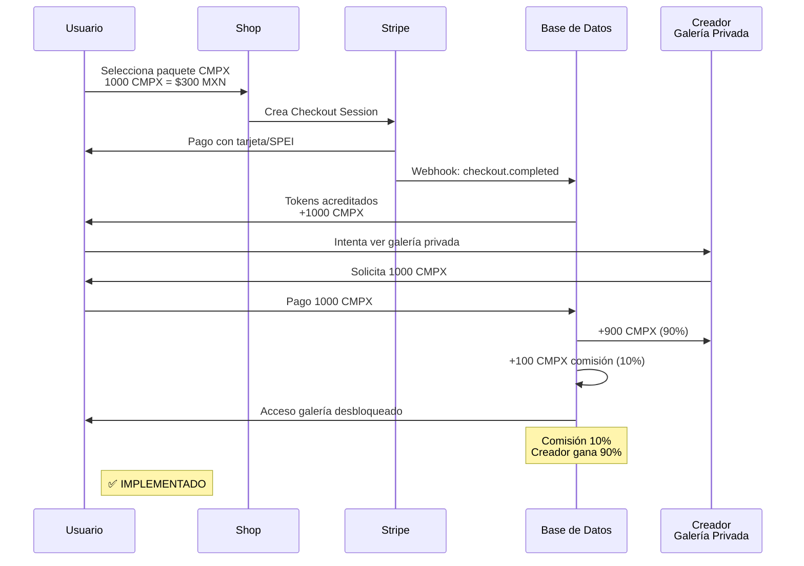
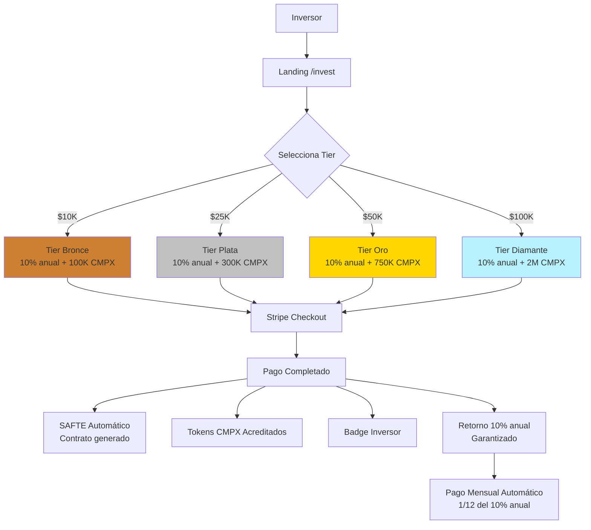
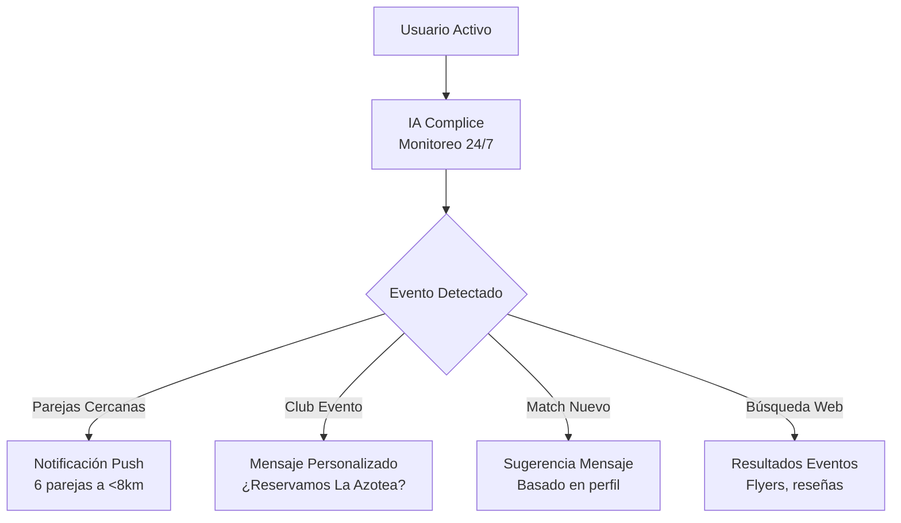

# 📊 DIAGRAMAS DE FLUJOS v3.8.0 - COMPLICESCONECTA v3.8.0

**Fecha:** 26 Diciembre 2025
**Versión:** 3.8.0
**Estado:** ✅ PRIVACY ENHANCED - UI POLISHED - CODE STANDARDIZED

---

## 🔄 FLUJO COMPLETO DE USUARIO (Actualizado v3.7.0)

---

## 🏢 FLUJO DE VERIFICACIÓN DE CLUB

---

## 🛡️ FLUJO DE MODERACIÓN COMPLETO

---

## 💎 FLUJO DE COMPRA Y USO DE TOKENS CMPX

---

## 💰 FLUJO DE DONATIVOS/INVERSIÓN

---

## 🤖 FLUJO DE IA COMPLICE (ASISTENTE PERSONAL)

---

### 🧩 Notas de Arquitectura de UI (v3.8.0)

graph TD
%% Lógica de Navegación Condicional
User[Usuario Navega] --> Router{¿Qué Ruta es?}

    %% Flujo Público
    Router -->|Ruta Pública / Landing| PublicLayout[Layout Público]
    PublicLayout --> ShowHeader[✅ MOSTRAR: HeaderNav]
    PublicLayout --> HideTabs[❌ OCULTAR: ProfileNavTabs]

    %% Flujo Privado (Perfiles)
    Router -->|Ruta Privada /profile| ProfileLayout[Layout Perfil]
    ProfileLayout --> HideHeader[❌ OCULTAR: HeaderNav]
    ProfileLayout --> ShowTabs[✅ MOSTRAR: ProfileNavTabs]

    %% Lógica del Botón de Login (Global)
    ShowHeader & ShowTabs --> AuthCheck{¿Autenticado?}
    AuthCheck -->|No| BtnLogin[Mostrar Botón: 'Iniciar Sesión']
    AuthCheck -->|Sí| BtnUser[Mostrar Botón: 'Nombre/Nickname']

    %% Estilos
    style PublicLayout fill:#e1f5fe,stroke:#01579b
    style ProfileLayout fill:#fff3e0,stroke:#e65100
    style HideHeader fill:#ffcdd2,stroke:#b71c1c
    style ShowTabs fill:#c8e6c9,stroke:#1b5e20

sequenceDiagram
participant User as Usuario
participant UI as Interfaz
participant Logic as Permisos

    User->>UI: Click en Imagen de Galería
    UI->>Logic: ¿Tiene Permiso de Visualización?

    alt Es VIP o Dueño
        Logic-->>UI: Acceso Total
        UI->>UI: Abrir Lightbox (Sin Blur)
    else Usuario Gratuito / No Match
        Logic-->>UI: Acceso Restringido
        UI->>UI: Abrir Lightbox + APLICAR BLUR (CSS filter)
        UI->>User: Mostrar Overlay "Desbloquear Foto"
        User->>UI: Click "Desbloquear"
        UI->>Logic: Procesar Pago/Token
        Logic-->>UI: Retirar Blur
    end

    sequenceDiagram
    participant User as Usuario
    participant UI as Interfaz
    participant Logic as Permisos

    User->>UI: Click en Imagen de Galería
    UI->>Logic: ¿Tiene Permiso de Visualización?

    alt Es VIP o Dueño
        Logic-->>UI: Acceso Total
        UI->>UI: Abrir Lightbox (Sin Blur)
    else Usuario Gratuito / No Match
        Logic-->>UI: Acceso Restringido
        UI->>UI: Abrir Lightbox + APLICAR BLUR (CSS filter)
        UI->>User: Mostrar Overlay "Desbloquear Foto"
        User->>UI: Click "Desbloquear"
        UI->>Logic: Procesar Pago/Token
        Logic-->>UI: Retirar Blur
    end

- ## Todos los flujos descritos se renderizan ahora bajo un **MainLayout** unificado que controla:
  - ## El sistema de fondos (`UnifiedBackground` + partículas híbridas) con gradientes nocturnos tipo Plexus.
  - ## La navegación global fija (`AppSidebar` + header) para evitar barras duplicadas por página.
- ## Las páginas de **Tokens**, **NFTs**, **Perfil Single** y **Settings** adoptan glassmorphism consistente para las cards principales, mientras que las sub-cards (proyecciones, ventajas, condiciones) usan un patrón glass ligero para marcar jerarquías visuales.
- ## Se añade un **Centro de Control IA** (`/ai-help`) como vista dedicada donde se explica al usuario qué es CómplicesConecta, cómo funciona la IA Local sobre WebLLM (modelo Phi‑3‑mini ejecutado en el navegador) y cómo se aplican las reglas legales del Libro Maestro (`app-master-context.md`). Desde esta página, el usuario puede interactuar con el Asistente IA Legal antes de firmar contratos o realizar operaciones con tokens/NFTs.

# Flujo de Funcionalidad NFT - CómplicesConecta

## 1. Descripción General

El sistema de NFTs permite a los usuarios (singles y parejas) "mintear" (crear) tokens no fungibles que representan contenido exclusivo o identidad en la blockchain de Polygon.

## 2. Componente Principal

`NFTMintButton` (`src/components/blockchain/NFTMintButton.tsx`)

### Props

- `userId`: ID del usuario.
- `type`: 'single' | 'couple'.
- `nftName`: Nombre del activo.
- `nftDescription`: Descripción.
- `imageFile`: Archivo a mintear.
- `partnerEmail`: (Requerido para 'couple').

## 3. Lógica de Negocio

### Validaciones

- **Tamaño de archivo:** Máximo 5MB.
- **Formato:** JPG, PNG, WEBP.
- **Parejas:** Requiere email de la pareja para flujo de doble consentimiento.

### Modos de Operación

1. **Modo Demo:**
   - Simula la transacción sin costo.
   - Retorna un `tokenId` simulado.
   - No interactúa con la blockchain real.
   - Ideal para pruebas y desarrollo.

2. **Modo Producción:**
   - Interactúa con `WalletService` y `NFTService`.
   - **Single:** Minteo directo.
   - **Couple:** Crea una solicitud de firma pendiente. La pareja debe aprobar.

## 4. Flujo de Usuario

1. Usuario selecciona imagen en Galería.
2. Clic en "Mintear NFT".
3. Se valida el archivo.
4. Feedback visual (Loading/Spinner).
5. **Éxito:**
   - Single: Mensaje "NFT Minteado".
   - Couple: Mensaje "Solicitud enviada a pareja".
6. **Error:**
   - Mensaje descriptivo (e.g., "Archivo muy grande").

## 5. Pruebas

## "Arquitectura UI"

A. Nuevo Flujo de Navegación (Header vs Tabs)

graph TD
%% Lógica de Navegación Condicional
User[Usuario Navega] --> Router{¿Qué Ruta es?}

    %% Flujo Público
    Router -->|Ruta Pública / Landing| PublicLayout[Layout Público]
    PublicLayout --> ShowHeader[✅ MOSTRAR: HeaderNav]
    PublicLayout --> HideTabs[❌ OCULTAR: ProfileNavTabs]

    %% Flujo Privado (Perfiles)
    Router -->|Ruta Privada /profile| ProfileLayout[Layout Perfil]
    ProfileLayout --> HideHeader[❌ OCULTAR: HeaderNav]
    ProfileLayout --> ShowTabs[✅ MOSTRAR: ProfileNavTabs]

    %% Lógica del Botón de Login (Global)
    ShowHeader & ShowTabs --> AuthCheck{¿Autenticado?}
    AuthCheck -->|No| BtnLogin[Mostrar Botón: 'Iniciar Sesión']
    AuthCheck -->|Sí| BtnUser[Mostrar Botón: 'Nombre/Nickname']

    %% Estilos
    style PublicLayout fill:#e1f5fe,stroke:#01579b
    style ProfileLayout fill:#fff3e0,stroke:#e65100
    style HideHeader fill:#ffcdd2,stroke:#b71c1c
    style ShowTabs fill:#c8e6c9,stroke:#1b5e20

B. Nuevo Flujo de Galería (Lógica del Blur)

## "Flujos de Usuario":

sequenceDiagram
participant User as Usuario
participant UI as Interfaz
participant Logic as Permisos

    User->>UI: Click en Imagen de Galería
    UI->>Logic: ¿Tiene Permiso de Visualización?

    alt Es VIP o Dueño
        Logic-->>UI: Acceso Total
        UI->>UI: Abrir Lightbox (Sin Blur)
    else Usuario Gratuito / No Match
        Logic-->>UI: Acceso Restringido
        UI->>UI: Abrir Lightbox + APLICAR BLUR (CSS filter)
        UI->>User: Mostrar Overlay "Desbloquear Foto"
        User->>UI: Click "Desbloquear"
        UI->>Logic: Procesar Pago/Token
        Logic-->>UI: Retirar Blur
    end

## "Flujo de Creación de NFT (El Botón Perdido)"

    graph LR
    %% Flujo de Creación
    Start((Inicio)) --> BtnCreate[Click: Botón 'Crear NFT']
    BtnCreate --> Upload{¿Subir o Seleccionar?}
    Upload -->|Galería| Select[Seleccionar de Galería Existente]
    Upload -->|Nuevo| Camera[Subir Foto Nueva]

    Select & Camera --> Preview[Vista Previa NFT]
    Preview --> Mint[Ejecutar Minting en Blockchain]
    Mint --> Wallet[Interacción Wallet]
    Wallet -->|Confirmado| Success[✨ NFT Creado en Perfil]

## "Arquitectura UI"

A. Nuevo Flujo de Navegación (Header vs Tabs)

graph TD
%% Lógica de Navegación Condicional
User[Usuario Navega] --> Router{¿Qué Ruta es?}

    %% Flujo Público
    Router -->|Ruta Pública / Landing| PublicLayout[Layout Público]
    PublicLayout --> ShowHeader[✅ MOSTRAR: HeaderNav]
    PublicLayout --> HideTabs[❌ OCULTAR: ProfileNavTabs]

    %% Flujo Privado (Perfiles)
    Router -->|Ruta Privada /profile| ProfileLayout[Layout Perfil]
    ProfileLayout --> HideHeader[❌ OCULTAR: HeaderNav]
    ProfileLayout --> ShowTabs[✅ MOSTRAR: ProfileNavTabs]

    %% Lógica del Botón de Login (Global)
    ShowHeader & ShowTabs --> AuthCheck{¿Autenticado?}
    AuthCheck -->|No| BtnLogin[Mostrar Botón: 'Iniciar Sesión']
    AuthCheck -->|Sí| BtnUser[Mostrar Botón: 'Nombre/Nickname']

    %% Estilos
    style PublicLayout fill:#e1f5fe,stroke:#01579b
    style ProfileLayout fill:#fff3e0,stroke:#e65100
    style HideHeader fill:#ffcdd2,stroke:#b71c1c
    style ShowTabs fill:#c8e6c9,stroke:#1b5e20

## "Flujos de Usuario"

B. Nuevo Flujo de Galería (Lógica del Blur)

sequenceDiagram
participant User as Usuario
participant UI as Interfaz
participant Logic as Permisos

    User->>UI: Click en Imagen de Galería
    UI->>Logic: ¿Tiene Permiso de Visualización?

    alt Es VIP o Dueño
        Logic-->>UI: Acceso Total
        UI->>UI: Abrir Lightbox (Sin Blur)
    else Usuario Gratuito / No Match
        Logic-->>UI: Acceso Restringido
        UI->>UI: Abrir Lightbox + APLICAR BLUR (CSS filter)
        UI->>User: Mostrar Overlay "Desbloquear Foto"
        User->>UI: Click "Desbloquear"
        UI->>Logic: Procesar Pago/Token
        Logic-->>UI: Retirar Blur
    end

## "Economía y Tokens"

C. Flujo de Creación de NFT (El Botón Perdido)

graph LR
%% Flujo de Creación
Start((Inicio)) --> BtnCreate[Click: Botón 'Crear NFT']
BtnCreate --> Upload{¿Subir o Seleccionar?}
Upload -->|Galería| Select[Seleccionar de Galería Existente]
Upload -->|Nuevo| Camera[Subir Foto Nueva]

    Select & Camera --> Preview[Vista Previa NFT]
    Preview --> Mint[Ejecutar Minting en Blockchain]
    Mint --> Wallet[Interacción Wallet]
    Wallet -->|Confirmado| Success[✨ NFT Creado en Perfil]
