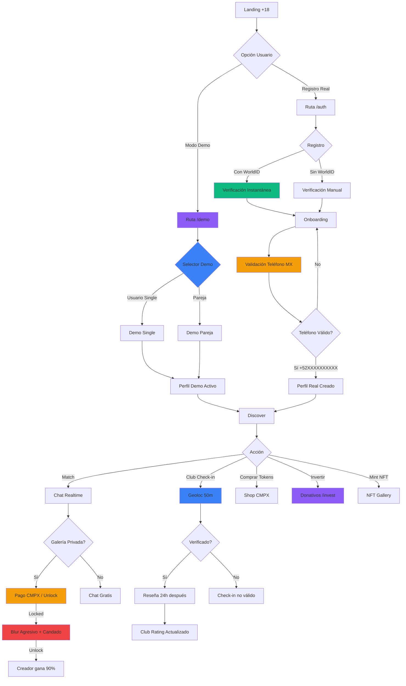
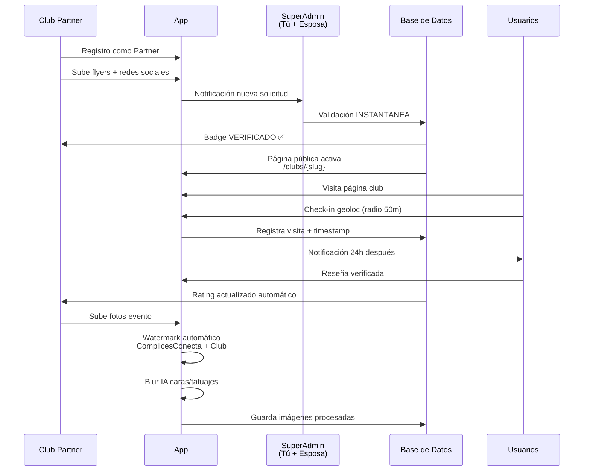
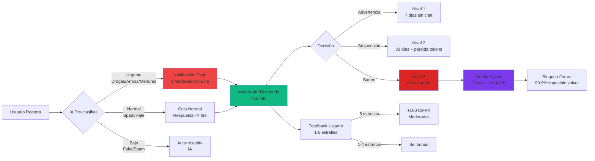
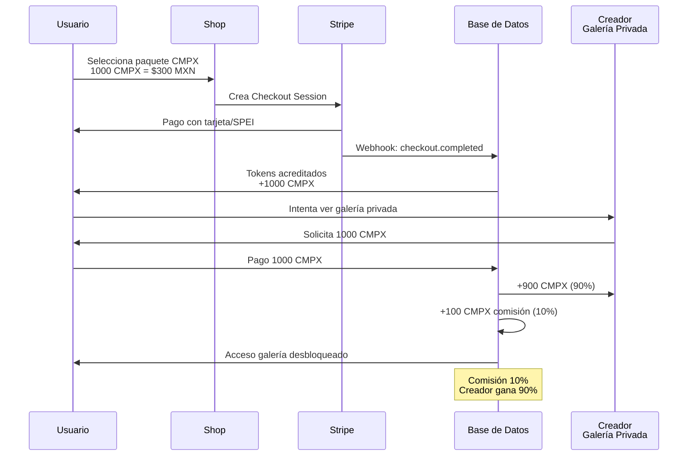
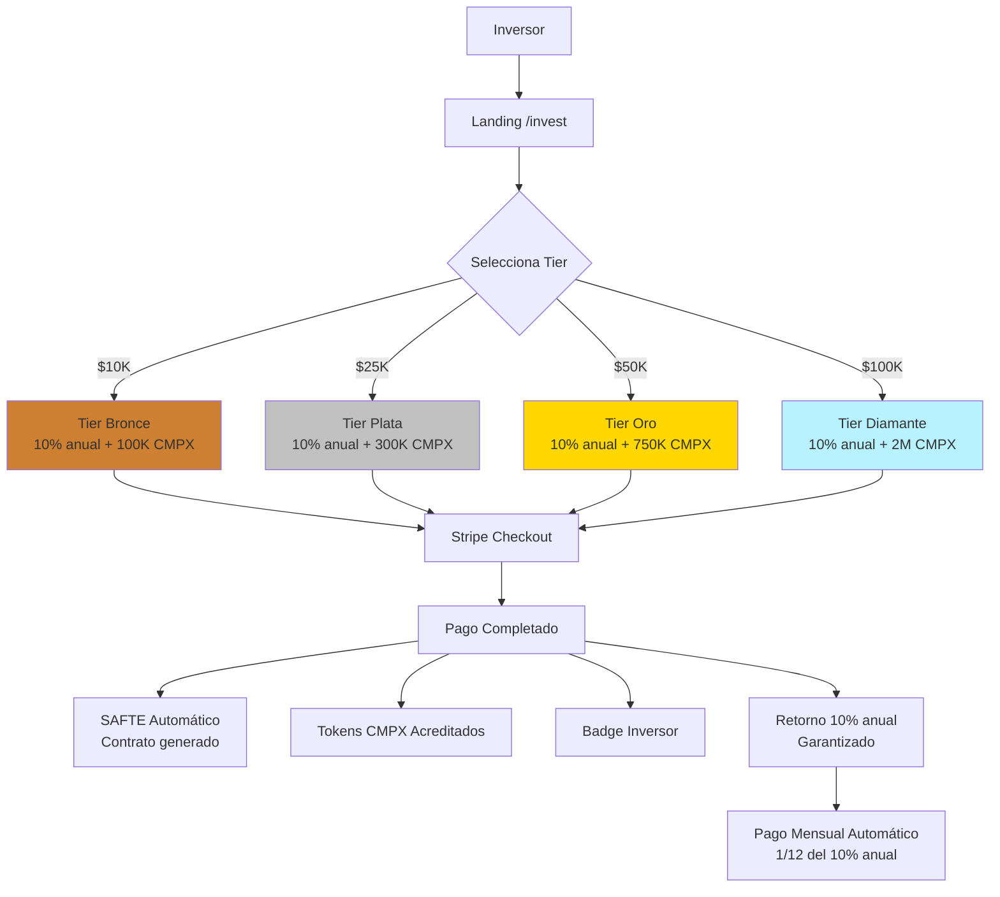
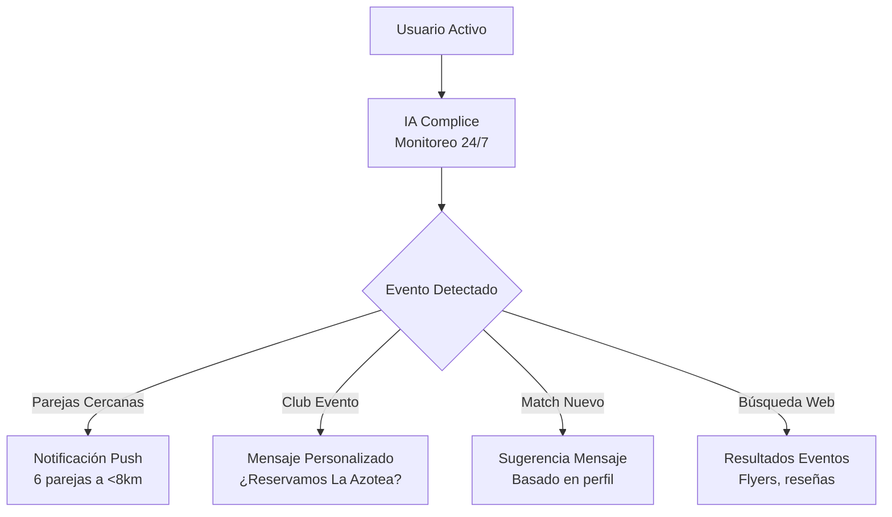

# 📊 DIAGRAMAS DE FLUJOS v3.8.0 - COMPLICESCONECTA v3.8.0

**Fecha:** 20 Diciembre 2025
**Versión:** 3.8.0
**Estado:** ✅ PRIVACY ENHANCED - UI POLISHED - ASSETS STANDARDIZED

---

## 🔄 FLUJO COMPLETO DE USUARIO (Actualizado v3.7.0)

---

## 🏢 FLUJO DE VERIFICACIÓN DE CLUB

---

## 🛡️ FLUJO DE MODERACIÓN COMPLETO

---

## 💎 FLUJO DE COMPRA Y USO DE TOKENS CMPX

---

## 💰 FLUJO DE DONATIVOS/INVERSIÓN

---

## 🤖 FLUJO DE IA COMPLICE (ASISTENTE PERSONAL)

