# 📊 DIAGRAMAS DE FLUJOS v3.6.6 - COMPLICESCONECTA v3.6.6

**Fecha:** 16 Diciembre 2025 (01:30 UTC-06:00)  
**Versión:** 3.6.6  
**Estado:** ✅ VITEST FIXED - ESLINT 0 ERRORS/WARNINGS - GLASSMORPHISM COMPONENT ADDED - BUILD OPTIMIZED

---

## 🔄 FLUJO COMPLETO DE USUARIO (Actualizado v3.6.4)

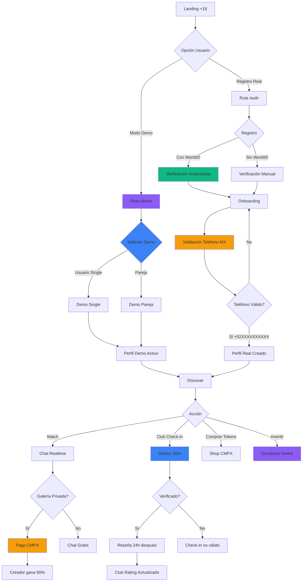

---

## 🏢 FLUJO DE VERIFICACIÓN DE CLUB

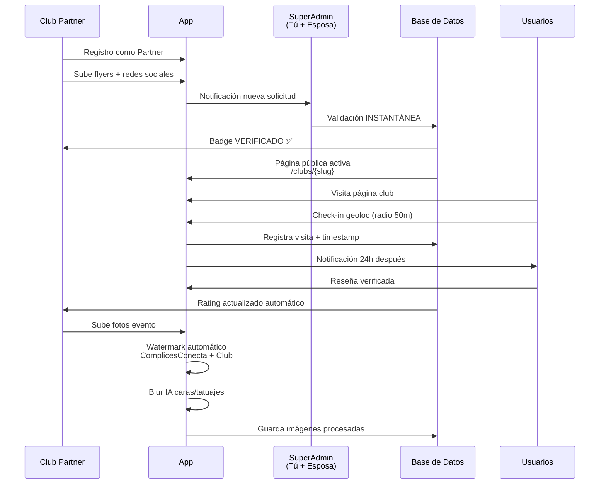

---

## 🛡️ FLUJO DE MODERACIÓN COMPLETO

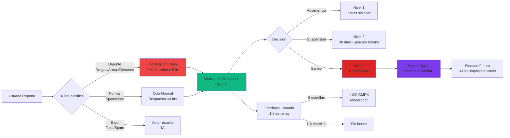

---

## 💎 FLUJO DE COMPRA Y USO DE TOKENS CMPX

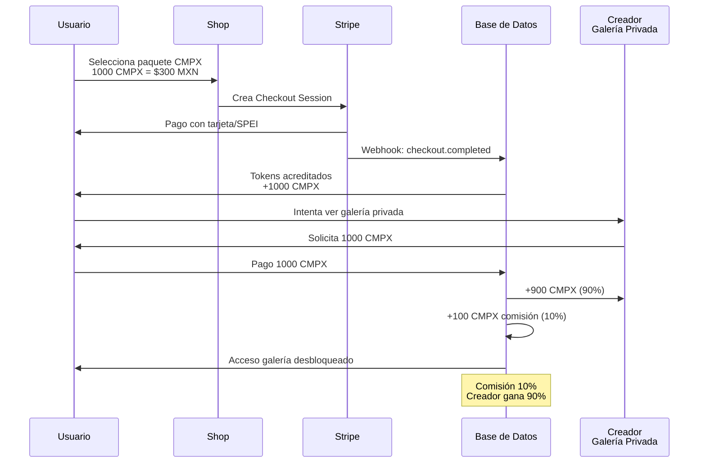

---

## 💰 FLUJO DE DONATIVOS/INVERSIÓN

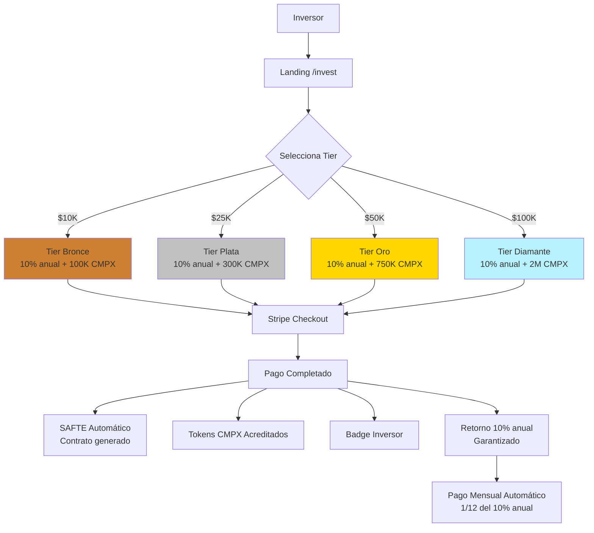

---

## 🤖 FLUJO DE IA COMPLICE (ASISTENTE PERSONAL)

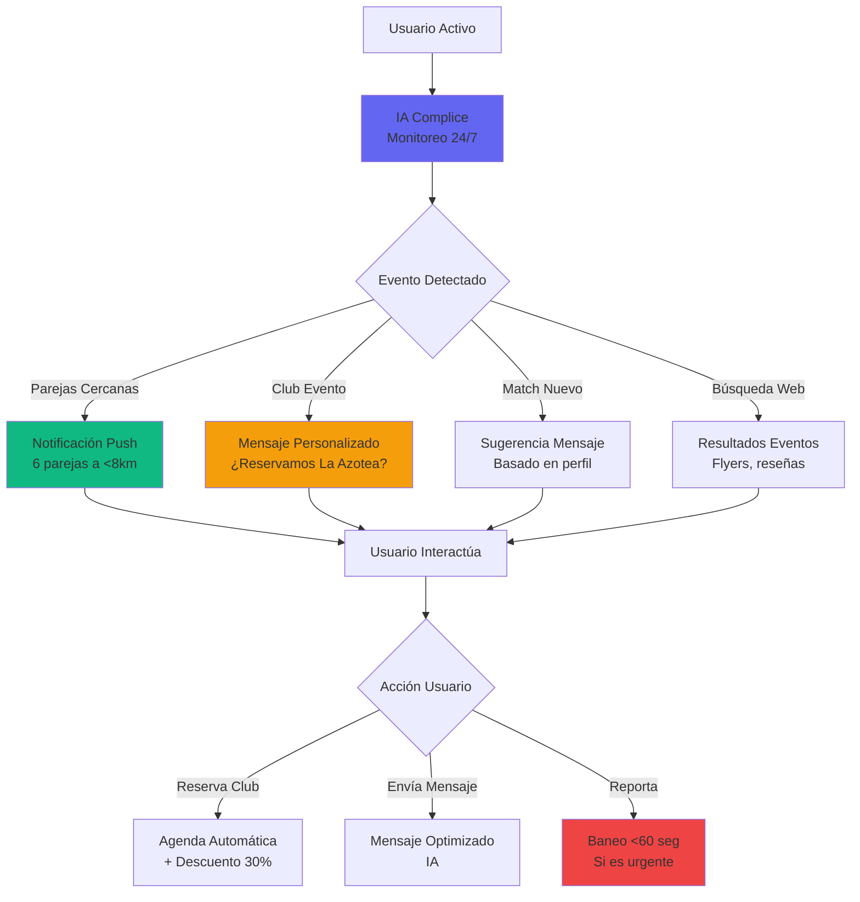

---

## 🔐 FLUJO DE BANEO PERMANENTE

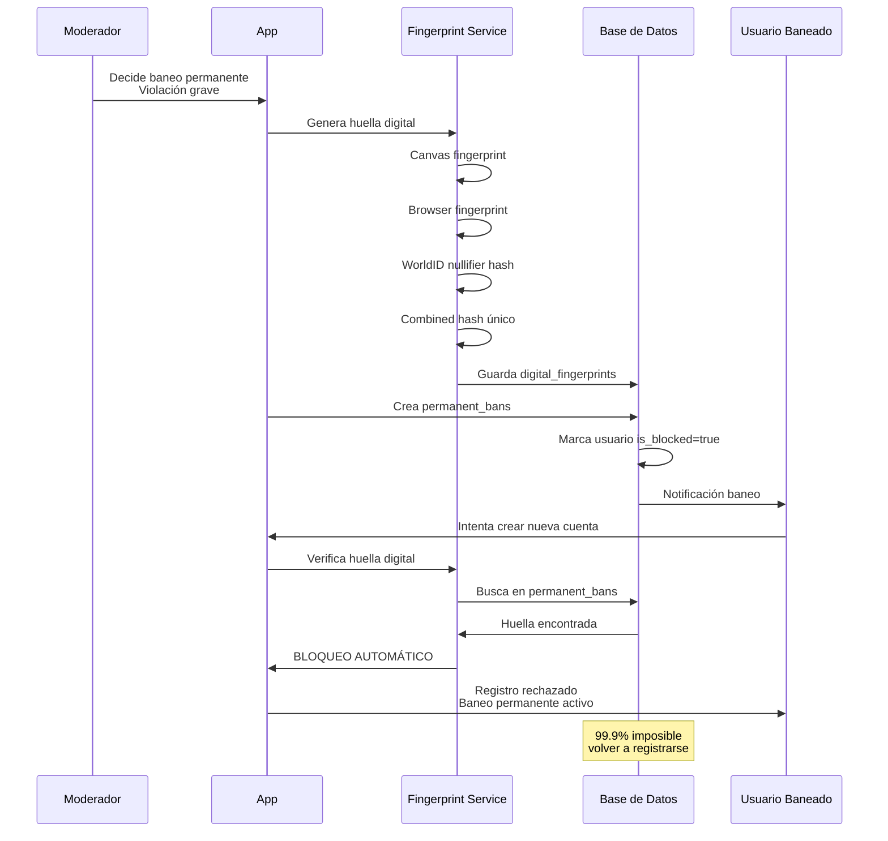

---

## 📊 FLUJO DE PAGOS AUTOMÁTICOS MODERADORES

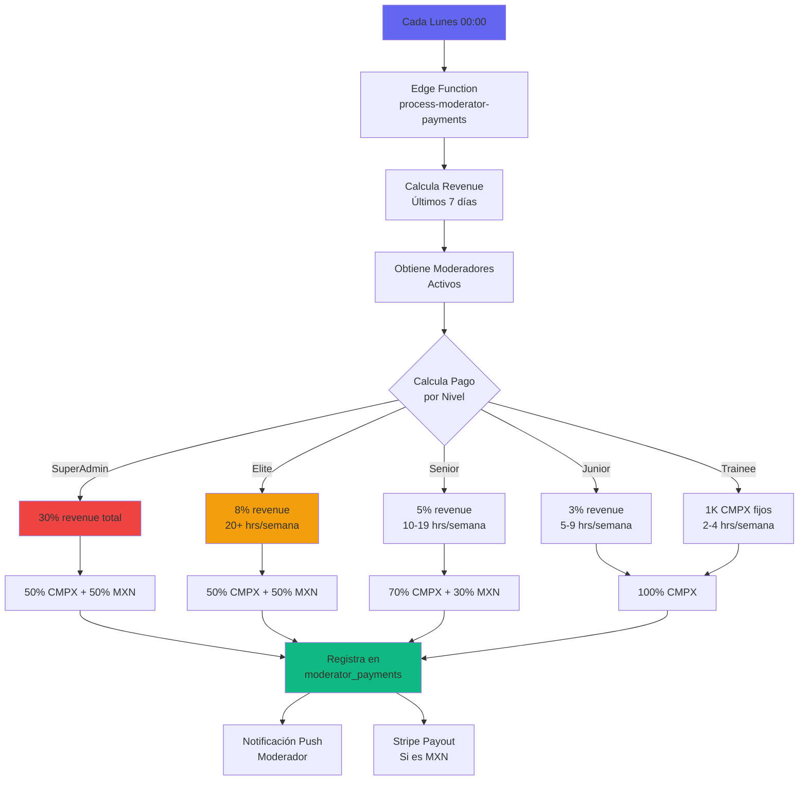

---

## 🏪 FLUJO DE PUBLICIDAD CLUBS

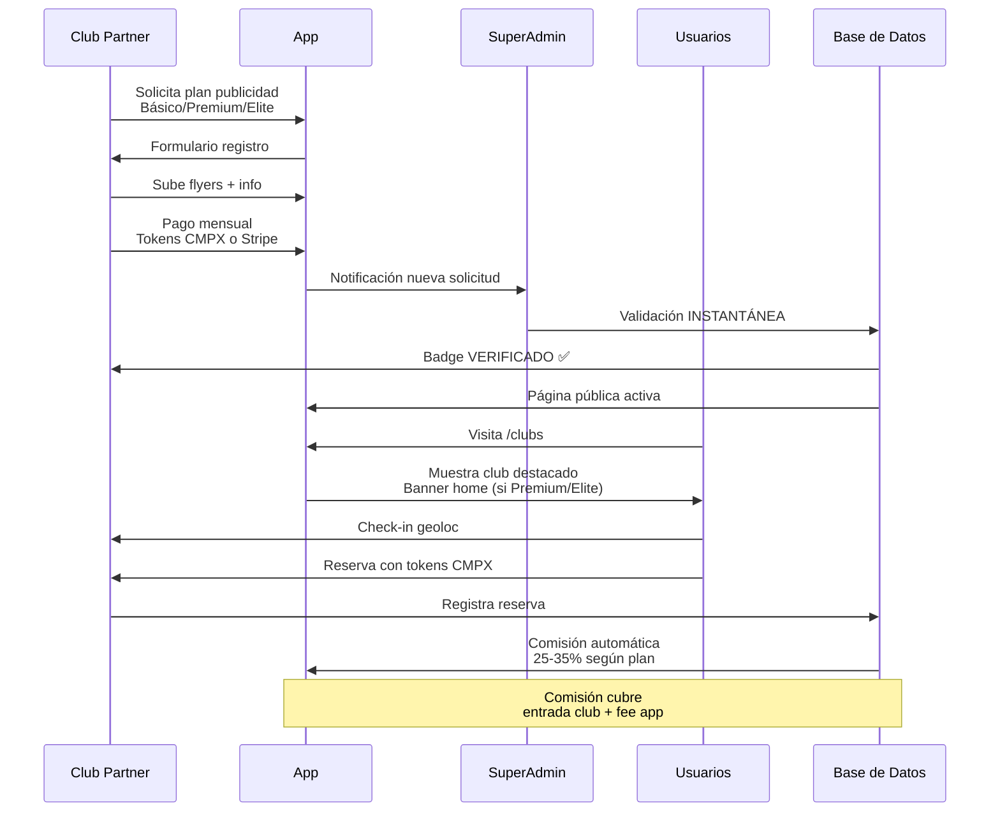

---

## 📈 FLUJO DE CRECIMIENTO ORGÁNICO

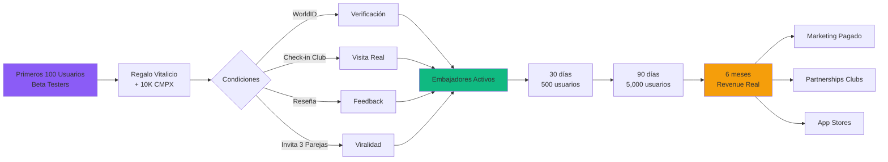

---

## 🔄 FLUJO DE STAKING CMPX

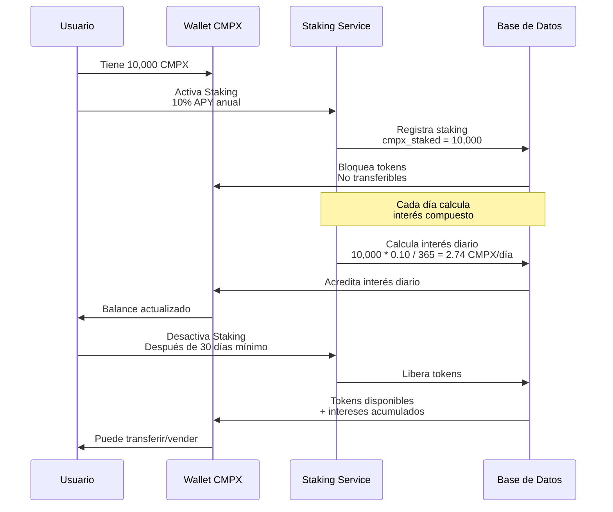

---

---

## 🔄 FLUJO DE ALINEACIÓN DE BASE DE DATOS v3.6.3

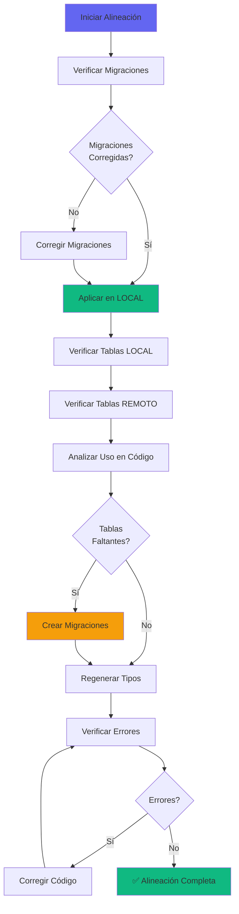

---

## 🚀 FLUJO DE DEPLOYMENT VERCEL v3.6.3

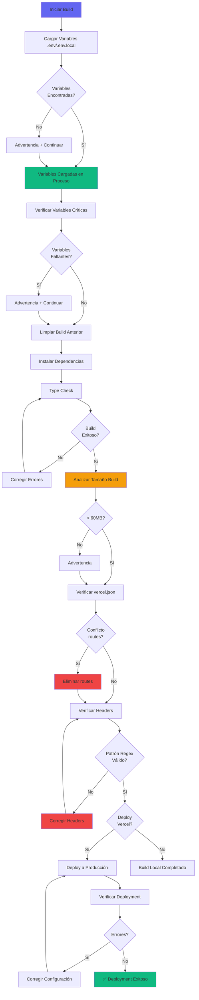

---

**Documento creado:** 06 Noviembre 2025  
**Última actualización:** 15 Noviembre 2025  
**Versión:** 1.4

### 🚀 Cambios v3.6.4 (15 Nov 2025)
- ✅ **FLUJO COMPLETO DE USUARIO actualizado** con ruta `/demo`
- ✅ Flujo de deployment Vercel actualizado con verificación de `vercel.json`
- ✅ Detección de conflictos `routes` vs `rewrites`/`headers`
- ✅ Validación de patrones regex en headers
- ✅ Carga automática de variables desde `.env`/`.env.local`
- ✅ Funciones globales `showEnvInfo()` y `showErrorReport()` disponibles en producción
- ✅ CircleCI configurado con Node.js 20.19+ (requerido por Vite 7.2.2)

