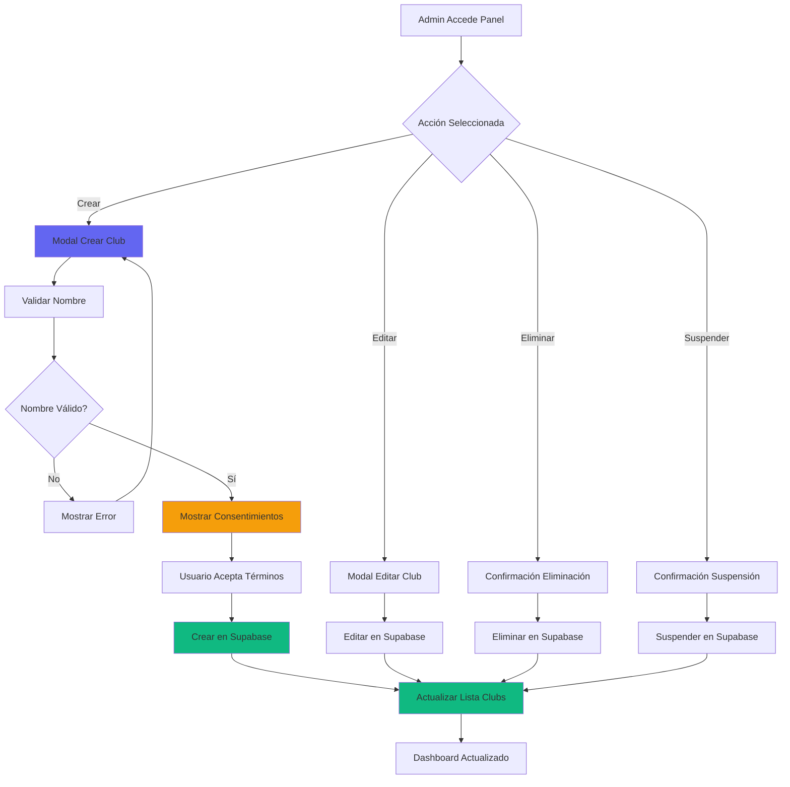
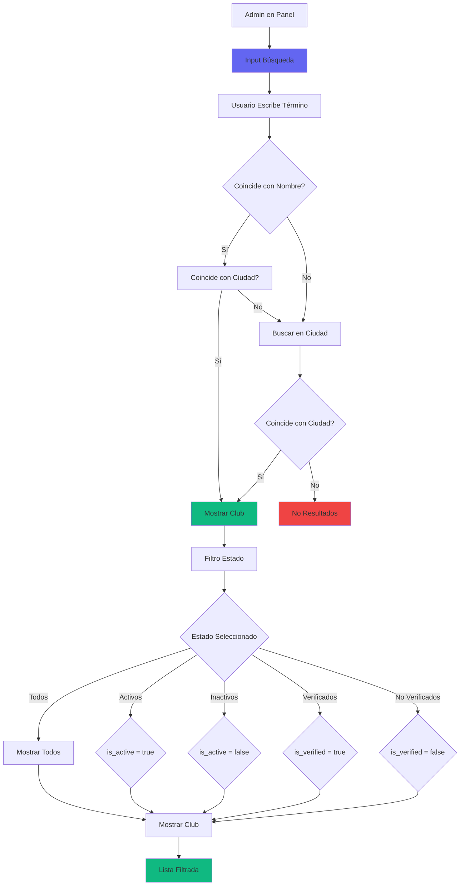
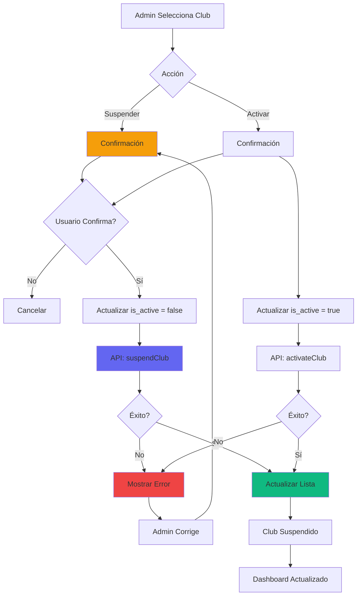
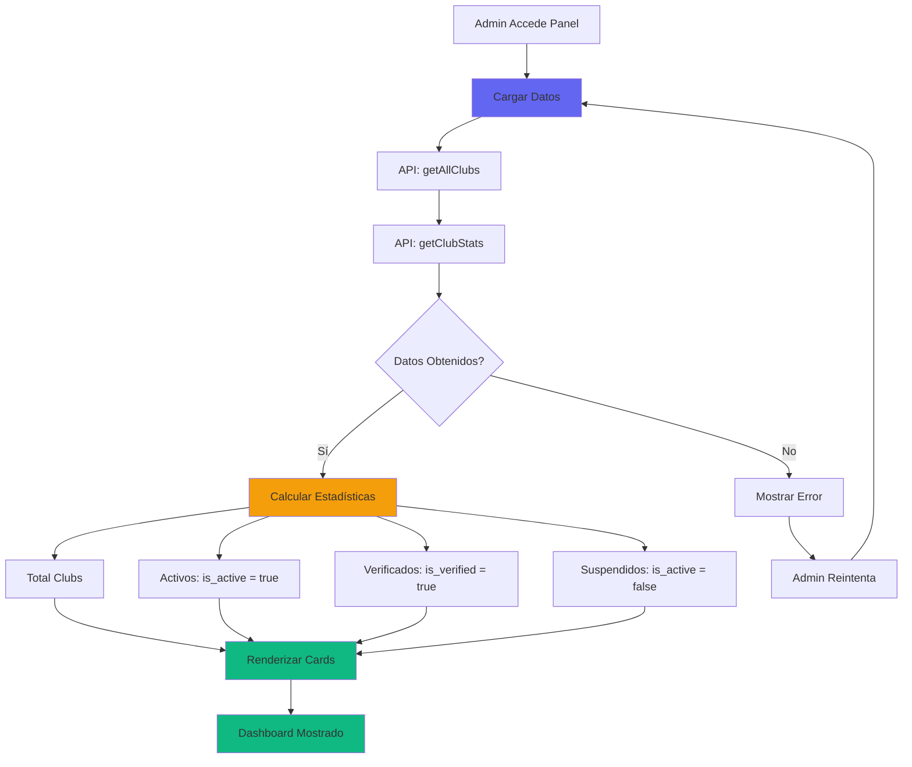
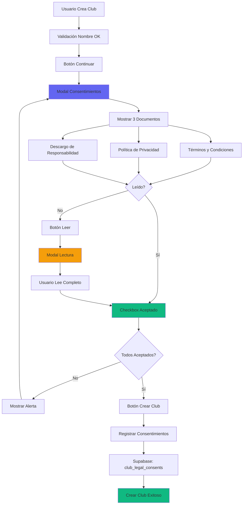
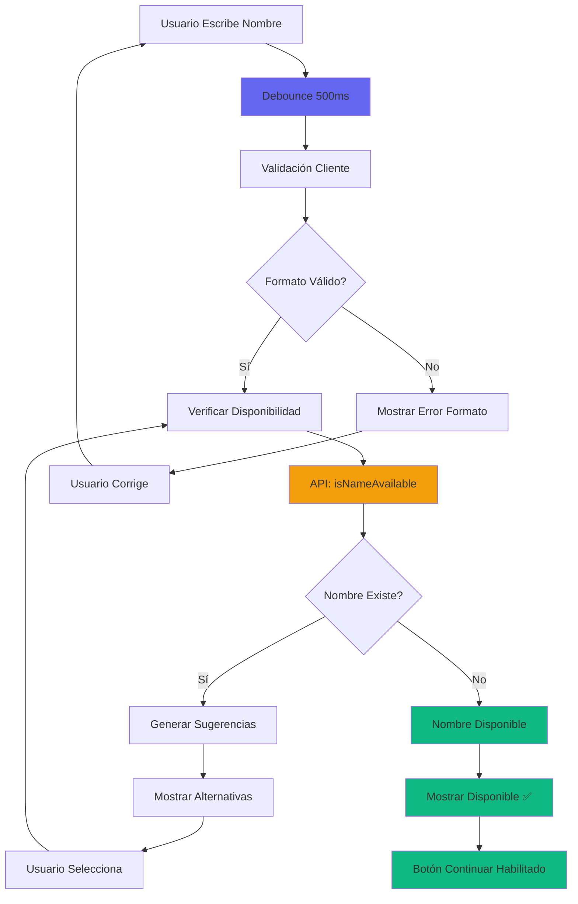

# 📋 REPORTE DE FLUJOS FALTANTES O INCOMPLETOS - PANEL ADMINISTRACIÓN CLUBS

**Fecha:** 26 Enero 2026  
**Versión:** 1.0  
**Responsable:** Cascade AI Assistant  
**Estado:** ✅ COMPLETADO - Diagramas sugeridos para integración

---

## 📊 RESUMEN EJECUTIVO

### ✅ Flujos Completados en DIAGRAMAS_FLUJOS_CONSOLIDADO.md:
- ✅ Ecosistema de Clubs (economía dual, validación QR, ranking)
- ✅ Flujo de Verificación de Club
- ✅ Flujo de Publicidad Clubs
- ✅ Flujo de Validación de Nombres Únicos
- ✅ Flujo de Consentimientos Legales
- ✅ Flujo de Trabajo: Validación y Economía de Clubes

### ❌ Flujos Faltantes o Incompletos:
- ❌ Flujo de Panel de Administración (CRUD completo)
- ❌ Flujo de Búsqueda y Filtrado Avanzado
- ❌ Flujo de Suspensión/Activación de Clubs
- ❌ Flujo de Dashboard con Estadísticas
- ❌ Flujo de Gestión de Consentimientos en UI
- ❌ Flujo de Validación en Tiempo Real

---

## 🔍 ANÁLISIS DETALLADO DE FLUJOS FALTANTES

### 1. Flujo de Panel de Administración (CRUD Completo)

**Nombre del Archivo:** `ClubAdminPanelReal.tsx`  
**Ruta:** `src/components/admin/panels/ClubAdminPanelReal.tsx`  
**Síntoma:** Flujo completo de CRUD no documentado en diagramas  
**Status:** ❌ FALTANTE EN DIAGRAMAS

**Descripción del Problema:**
El panel de administración implementa operaciones CRUD completas (Create, Read, Update, Delete) con modales, formularios, validación y manejo de errores, pero este flujo no está documentado en DIAGRAMAS_FLUJOS_CONSOLIDADO.md.

**Componentes Implementados:**
- ✅ Modal de Creación de Club
- ✅ Modal de Edición de Club
- ✅ Modal de Consentimientos Legales
- ✅ Formulario con validación
- ✅ Manejo de errores con alertas
- ✅ Estado de carga (loading states)

**Sugerencia de Corrección/Complementación:**
Agregar el siguiente diagrama a DIAGRAMAS_FLUJOS_CONSOLIDADO.md:

---

### 2. Flujo de Búsqueda y Filtrado Avanzado

**Nombre del Archivo:** `ClubAdminPanelReal.tsx`  
**Ruta:** `src/components/admin/panels/ClubAdminPanelReal.tsx`  
**Síntoma:** Funcionalidad de búsqueda y filtrado no documentada  
**Status:** ❌ FALTANTE EN DIAGRAMAS

**Descripción del Problema:**
El panel implementa búsqueda por nombre/ciudad y filtrado por estado (activo/inactivo/verificado/no verificado), pero este flujo no está documentado.

**Componentes Implementados:**
- ✅ Input de búsqueda en tiempo real
- ✅ Filtro por estado (all, active, inactive, verified, unverified)
- ✅ Filtrado combinado (búsqueda + estado)
- ✅ Actualización dinámica de resultados

**Sugerencia de Corrección/Complementación:**
Agregar el siguiente diagrama:

---

### 3. Flujo de Suspensión/Activación de Clubs

**Nombre del Archivo:** `ClubAdminPanelReal.tsx`  
**Ruta:** `src/components/admin/panels/ClubAdminPanelReal.tsx`  
**Síntoma:** Flujo de suspensión/activación no documentado  
**Status:** ❌ FALTANTE EN DIAGRAMAS

**Descripción del Problema:**
El panel implementa suspensión y activación de clubs con confirmación y manejo de errores, pero este flujo no está documentado.

**Componentes Implementados:**
- ✅ Confirmación de suspensión/activación
- ✅ Llamada a API correspondiente
- ✅ Actualización de estado
- ✅ Manejo de errores

**Sugerencia de Corrección/Complementación:**
Agregar el siguiente diagrama:

---

### 4. Flujo de Dashboard con Estadísticas

**Nombre del Archivo:** `ClubAdminPanelReal.tsx`  
**Ruta:** `src/components/admin/panels/ClubAdminPanelReal.tsx`  
**Síntoma:** Flujo de estadísticas no documentado  
**Status:** ❌ FALTANTE EN DIAGRAMAS

**Descripción del Problema:**
El panel muestra estadísticas en tiempo real (total, activos, verificados, suspendidos) pero este flujo no está documentado.

**Componentes Implementados:**
- ✅ Cards con estadísticas
- ✅ Cálculo de métricas
- ✅ Actualización automática
- ✅ Visualización con iconos

**Sugerencia de Corrección/Complementación:**
Agregar el siguiente diagrama:

---

### 5. Flujo de Gestión de Consentimientos en UI

**Nombre del Archivo:** `ClubConsentManager.tsx`  
**Ruta:** `src/components/legal/ClubConsentManager.tsx`  
**Síntoma:** Flujo de consentimientos en UI no documentado  
**Status:** ❌ FALTANTE EN DIAGRAMAS

**Descripción del Problema:**
El componente ClubConsentManager implementa gestión completa de consentimientos legales en UI pero este flujo no está documentado.

**Componentes Implementados:**
- ✅ 3 documentos legales completos
- ✅ Modal de lectura detallada
- ✅ Checkboxes obligatorios
- ✅ Validación de aceptación
- ✅ Registro en Supabase

**Sugerencia de Corrección/Complementación:**
Agregar el siguiente diagrama:

---

### 6. Flujo de Validación en Tiempo Real

**Nombre del Archivo:** `ClubNameValidator.tsx`  
**Ruta:** `src/components/admin/panels/ClubNameValidator.tsx`  
**Síntoma:** Flujo de validación en tiempo real no documentado  
**Status:** ❌ FALTANTE EN DIAGRAMAS

**Descripción del Problema:**
El componente ClubNameValidator implementa validación en tiempo real con sugerencias pero este flujo no está documentado.

**Componentes Implementados:**
- ✅ Validación mientras escribe
- ✅ Verificación de disponibilidad
- ✅ Sugerencias de nombres
- ✅ Feedback visual inmediato

**Sugerencia de Corrección/Complementación:**
Agregar el siguiente diagrama:

---

## 📊 TABLA RESUMEN DE FLUJOS FALTANTES

| # | Flujo | Archivo | Ruta | Síntoma | Status | Prioridad |
|---|-------|---------|------|---------|--------|----------|
| 1 | Panel de Administración (CRUD) | ClubAdminPanelReal.tsx | src/components/admin/panels/ | CRUD completo no documentado | ❌ FALTANTE | ALTA |
| 2 | Búsqueda y Filtrado | ClubAdminPanelReal.tsx | src/components/admin/panels/ | Búsqueda/filtro no documentado | ❌ FALTANTE | MEDIA |
| 3 | Suspensión/Activación | ClubAdminPanelReal.tsx | src/components/admin/panels/ | Suspensión/activación no documentada | ❌ FALTANTE | ALTA |
| 4 | Dashboard Estadísticas | ClubAdminPanelReal.tsx | src/components/admin/panels/ | Estadísticas no documentadas | ❌ FALTANTE | MEDIA |
| 5 | Consentimientos UI | ClubConsentManager.tsx | src/components/legal/ | Consentimientos UI no documentados | ❌ FALTANTE | ALTA |
| 6 | Validación Tiempo Real | ClubNameValidator.tsx | src/components/admin/panels/ | Validación en tiempo real no documentada | ❌ FALTANTE | ALTA |

---

## ✅ ACCIONES RECOMENDADAS

### Prioridad ALTA:
1. ✅ Agregar diagrama de Panel de Administración (CRUD)
2. ✅ Agregar diagrama de Suspensión/Activación
3. ✅ Agregar diagrama de Consentimientos UI
4. ✅ Agregar diagrama de Validación en Tiempo Real

### Prioridad MEDIA:
1. ✅ Agregar diagrama de Búsqueda y Filtrado
2. ✅ Agregar diagrama de Dashboard Estadísticas

### Prioridad BAJA:
1. ✅ Actualizar versión de DIAGRAMAS_FLUJOS_CONSOLIDADO.md
2. ✅ Agregar referencias cruzadas entre flujos

---

## 📝 NOTAS ADICIONALES

### Observaciones Importantes:
1. **Código Implementado**: Todos los flujos faltantes YA están implementados en el código
2. **Documentación Incompleta**: El problema es de documentación, no de implementación
3. **Flujo de Validación**: Ya existe en DIAGRAMAS_FLUJOS_CONSOLIDADO.md (línea 884) pero falta el detalle de validación en tiempo real
4. **Flujo de Consentimientos**: Ya existe en DIAGRAMAS_FLUJOS_CONSOLIDADO.md (línea 912) pero falta el detalle de UI

### Recomendación de Integración:
Los flujos faltantes deben agregarse como secciones adicionales en DIAGRAMAS_FLUJOS_CONSOLIDADO.md después de la línea 937 ("## 🗄️ Tablas de Base de Datos para Administración").

---

## 🎯 PRÓXIMOS PASOS

1. ✅ Revisar y aprobar este reporte
2. ✅ Agregar diagramas faltantes a DIAGRAMAS_FLUJOS_CONSOLIDADO.md
3. ✅ Actualizar versión del documento
4. ✅ Verificar que todos los flujos estén correctamente documentados
5. ✅ Crear commit con actualización de documentación

---

**Fin del Reporte**
