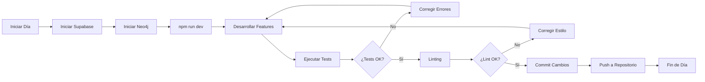

# 📁 PROJECT STRUCTURE TREE - ComplicesConecta v3.8.18

**Última Actualización:** 6 de Diciembre, 2025  
**Versión:** 3.8.18  
**Estado:** ✅ **PRODUCTION READY - AI-NATIVE - ENTERPRISE GRADE - 100% TYPE-SAFE - SUPABASE/NEO4J ALINEADOS - BUILD OPTIMIZADO**  
**Puntuación:** 97/100 ✅ (Estructura: 100/100, Lógica: 100/100, Consistencia: 97/100)  
**Build:** ✅ 24.4s (optimizado) | **Linting:** ✅ 0 errores | **TypeScript:** ✅ 0 errores (100% TYPE-SAFE) | **Vercel:** ✅ Configurado | **Docker:** ✅ Integrado | **Neo4j:** ✅ Operativo

## 📋 **ÍNDICE RÁPIDO**

### 🏗️ Arquitectura
- [📦 Monorepo Overview](#-estructura-general-del-monorepo)
- [🗂️ Directorios Clave](#-estructura-general-del-monorepo)
- [🗃️ Base de Datos Supabase/Neo4j](#-base-de-datos-supabase)

### ⚙️ Tooling & Dev
- [🧪 Testing & Scripts](#-edge-functions)
- [🚀 Flujo Dev + Comandos](#-flujo-de-desarrollo)

### 📅 Avances 26 Nov – 6 Dic 2025
- `search_unified` (pg_trgm + RPC) integrado en Supabase y expuesto en `GlobalSearchService`/`VanishSearchInput`.
- Control Parental **único global Ley Olimpia** aplicado a perfiles single/couple y galerías privadas (`ProfileSingle.tsx`, `ProfileCouple.tsx`, `PrivateImageGallery.tsx`) con contador estricto y relock automático.
- Tokens/NFT Dashboard con grid 2x4, animaciones globales y HeaderNav minimalista.
- Onboarding reducido a 3 pantallas principales, destacando privacidad y Ley Olimpia.
- Migraciones `20251106xxxx` blindadas para entornos locales (RLS matches, consent, virtual events, NFTs).

### Funcionalidades destacadas v3.7.2:
- **Consolidación UI completa:** todos los componentes compartidos (Button/Input/Modal, etc.) se encuentran en `src/components/ui/*`. `src/shared/ui` dejó de existir para evitar rutas duplicadas.
- **Arquitectura Vite pura:** se eliminaron los layout folders `src/app/(admin|clubs|discover|auth)` heredados de Next.js. Las páginas viven en `src/pages/**` y se cargan vía `React.lazy`/`utils/lazyComponents`.
- **Tailwind/PostCSS actualizado:** `postcss.config.js` usa `@tailwindcss/postcss` + `autoprefixer`, requisito para Tailwind 4.1.17 en Vite.
- **Iconografía Lucide:** `AlertConfigPanel`, `AnalyticsDashboard`, `ModerationMetrics` y `WebhookConfigPanel` dependen de `lucide-react`, eliminando heroicons.

### Funcionalidades Avanzadas previas (v3.5.0 – v3.7.0):
- **AI-Native Layer (Fase 1)**: ML Compatibility Scoring + Chat Summaries (100%)
- **PyTorch/TensorFlow.js**: Modelos pre-entrenados (400K parámetros)
- **Chat Summaries ML**: GPT-4, BART (HuggingFace), Fallback (3 opciones)
- **Google S2 Geosharding (Fase 2.1)**: Cell ID generation + migration (100% estructura, 70% total)
- **Neo4j Graph Database (Fase 2.2)**: Graph database para conexiones sociales (100% implementado) ✅
- **Base de Datos**: 52+ tablas operativas (80+ índices, 65+ RLS) + Neo4j Graph Database ✅
- **Sistema de Clubs Verificados**: 5 tablas nuevas (clubs, club_verifications, club_checkins, club_reviews, club_flyers) ✅
- **Sistema de Moderación 24/7**: 3 tablas nuevas (moderator_sessions, moderator_payments, report_ai_classification) ✅
- **Sistema de Tokens CMPX Shop**: 3 tablas nuevas (cmpx_shop_packages, cmpx_purchases, gallery_commissions) ✅
- **Sistema de Donativos/Inversión**: 4 tablas nuevas (investments, investment_returns, investment_tiers, stripe_events) ✅
- **Sistema de Baneo Permanente**: 2 tablas nuevas (digital_fingerprints, permanent_bans) ✅
- **Refactorización Completa**: PostCSS + CSS + Consolidación (-77% duplicación) ✅
- **Sistema de Monitoreo Completo**: Performance, Error Alerting, Analytics Dashboard (95%)
- **Sistema de Chat con Privacidad (NUEVO v3.5.0)**: ChatRoom + MessageList + ChatPrivacyService (100%) ✅
- **Geolocalización en Chat**: Compartir ubicación en mensajes integrado ✅

### Funcionalidades Blockchain v3.7.0 Implementadas:
- **Sistema Blockchain Completo**: 8 tablas blockchain operativas (user_wallets, testnet_token_claims, daily_token_claims, user_nfts, couple_nft_requests, nft_staking, token_staking, blockchain_transactions) ✅
- **Contratos Inteligentes**: CMPX Token, CoupleNFT, StakingPool (Hardhat + Ethers.js) ✅
- **WalletService**: Creación automática de wallets, encriptación AES-256, gestión de tokens ✅
- **NFTService**: Mint individual/pareja, IPFS integration (Pinata), sistema de consentimiento ✅
- **Tipos Seguros**: Eliminación completa de 'as any', helpers safeBlockchainCast/safeGet ✅
- **Migraciones**: Aplicadas exitosamente con políticas RLS y triggers automáticos ✅
- **Permisos de Galería desde Chat**: Solicitud de acceso integrada ✅
- **Video Chat Preparado**: VideoChatService estructura lista para futuro ✅
- **Mejoras Visuales CSS**: Gradientes purple/blue, visibilidad mejorada ✅
- **Silenciamiento Ultra Agresivo Wallet Errors**: Captura por mensaje, archivo y stack trace ✅
- **React Polyfills Mejorados**: Todos los hooks disponibles globalmente, fallbacks completos ✅
- **Navegación Condicional**: HeaderNav/Navigation según autenticación en TokensInfo y Tokens ✅
- **Documentación Interna de Tokens**: Solo visible para usuarios autenticados ✅
- **Correcciones UI**: Botón "Todas" corregido, textos invisibles en TokenChatBot resueltos ✅
- **Datadog RUM**: Real User Monitoring con Web Vitals y Session Tracking
- **Sistema de Seguridad**: SecurityAuditService con monitoreo continuo y detección de amenazas
- **Moderación con IA**: AdvancedModerationPanel con métricas y KPIs para moderadores

### Estructura General del Monorepo

```
conecta-social-comunidad-main/
├── src/                          # Frontend React + TypeScript
│   ├── App.tsx                   # Componente raíz de la SPA
│   ├── EnvDebug.tsx              # Herramienta de depuración de entorno
│   ├── debug.tsx                 # Pantalla de debug
│   ├── main.tsx                  # Punto de entrada Vite/React
│   ├── index.css                 # Estilos globales principales
│   ├── vite-env.d.ts             # Tipos de entorno Vite
│   ├── assets/                   # Recursos estáticos (imágenes, SVG, etc.)
│   ├── components/               # Componentes reutilizables (UI + features)
│   │   ├── ui/                  # Biblioteca centralizada (shadcn + variantes love/passion/premium)
│   │   └── ...
│   ├── config/                   # Configuraciones (Sentry, Datadog, etc.)
│   ├── context/                  # React Context providers compartidos
│   ├── demo/                     # Flujos y pantallas de demo
│   ├── entities/                 # Entidades y tipos de dominio
│   ├── examples/                 # Ejemplos aislados / sandboxes
│   ├── features/                 # Lógica reusable por feature (auth, chat, profile, etc.)
│   ├── hooks/                    # Custom React hooks compartidos
│   ├── integrations/             # Integraciones externas (Supabase, APIs, etc.)
│   ├── lib/                      # Librerías y utilidades de infraestructura
│   ├── pages/                    # Routing oficial (Auth, Discover, Clubs, Admin, etc.)
│   ├── profiles/                 # Perfiles (single, couple, shared)
│   ├── services/                 # Servicios de negocio (AI, matching, NFT, etc.)
│   ├── shared/                   # Librerías comunes (lib, hooks); *UI 100% migrada a components/ui*
│   ├── styles/                   # Sistema de estilos consolidado (CSS)
│   ├── tests/                    # Tests unitarios/e2e específicos de frontend
│   ├── types/                    # Tipos globales y contratos TS
│   └── utils/                    # Utilidades genéricas (helpers, format, etc.)
├── supabase/                     # Backend Supabase (ACTUALIZADO v3.4.1)
src/profiles/                      # Perfiles organizados (single / couple / shared)
├── single/                        # Perfiles individuales
│   ├── ProfileSingle.tsx          # Página de perfil individual (control parental + NFTs + eventos)
│   ├── EditProfileSingle.tsx      # Edición de perfil individual
│   ├── SingleCard.tsx             # Tarjeta de perfil individual (listados)
│   ├── SingleRegistrationForm.tsx # Formulario de registro individual (Supabase + profiles)
│   ├── SingleProfileHeader.tsx    # Encabezado del perfil individual
│   └── ...                        # Otros componentes auxiliares
├── couple/                        # Perfiles de parejas
│   ├── ProfileCouple.tsx          # Página de perfil de pareja (control parental + NFTs shared)
│   ├── EditProfileCouple.tsx      # Edición de perfil de pareja
│   ├── CoupleCard.tsx             # Tarjeta resumen de pareja
│   ├── CoupleProfileCard.tsx      # Tarjeta de detalle de pareja
│   ├── CouplePhotoSection.tsx     # Sección de fotos de pareja (privadas/públicas)
│   ├── CoupleImageGallery.tsx     # Galería de imágenes de pareja
│   ├── CoupleImageUpload.tsx      # Subida de imágenes de pareja
│   ├── CoupleProfileHeader.tsx    # Encabezado de perfil de pareja
│   ├── CoupleDashboard.tsx        # Dashboard de pareja (estadísticas, acciones rápidas)
│   ├── CoupleRegistrationForm.tsx # Formulario de registro de pareja
│   ├── AdvancedCoupleService.ts   # Lógica avanzada de parejas (matching, reglas de negocio)
│   ├── CoupleProfilesService.ts   # Servicio de integración de perfiles de pareja
│   ├── InterestsSelector.tsx      # Selector de intereses de pareja
│   ├── NicknameValidator.tsx      # Validador de alias/nickname de pareja
│   ├── PasswordValidator.tsx      # Validador de password de pareja
│   ├── TermsModal.tsx             # Modal de términos y condiciones para parejas
│   └── useCouplePhotos.ts         # Hook para gestionar fotos de pareja
└── shared/                        # Componentes compartidos entre tipos de perfil  
    ├──Profiles.tsx               # Lista de perfiles (filtro/búsqueda)  
    ├── ProfileDetail.tsx          # Vista detallada de perfil (single/couple unificado)
    ├── ProfileCard.tsx            # Tarjeta básica de perfil
    ├── MainProfileCard.tsx        # Tarjeta principal (hero perfil)
    ├── AnimatedProfileCard.tsx    # Tarjeta con animaciones avanzadas
    ├── DiscoverProfileCard.tsx    # Card para sección Discover
    ├── ProfileGrid.tsx            # Grid de perfiles
    ├
│   ├── functions/                # Edge Functions serverless
│   │   ├── send-email/           # Sistema de emails
│   │   ├── push-notifications/   # Notificaciones push
│   │   └── ai-matching/          # Algoritmo de matching IA
│   └── migrations/               # Migraciones de base de datos (20 migraciones)
│       ├── 20250122000003_create_security_tables_fixed.sql    # Tablas seguridad
│       ├── 20250122000004_create_couple_tables.sql            # Tablas parejas
│       ├── 20251029000000_create_monitoring_tables.sql        # Tablas monitoreo (NUEVO v3. 4.    1)
│       ├── 20251029100000_create_interests_tables.sql         # Tablas intereses (NUEVO v3.4.1)
│       ├── 20251029100001_create_worldid_verifications.sql    # World ID (NUEVO v3.4.1)
│       ├── 20251106_05_create_club_system.sql            # Sistema de clubs (NUEVO v3.5.0)
│       ├── 20251106_06_create_investment_system.sql      # Sistema de inversiones (NUEVO v3.5.0)
│       ├── 20251106_07_create_moderation_v2_system.sql  # Moderación v2 (NUEVO v3.5.0)
│       ├── 20251106_08_create_permanent_ban_system.sql  # Baneo permanente (NUEVO v3.5.0)
│       ├── 20251106_09_create_cmpx_shop_system.sql      # Shop CMPX (NUEVO v3.5.0)
├── scripts/                      # Scripts de utilidad (19+ scripts)
│   ├── database-manager.ps1                   # Script maestro de gestión de BD (NUEVO v3.6.3 - unifica 5 scripts)
│   ├── alinear-y-verificar-todo.ps1          # Alinear y verificar tablas local/remoto (NUEVO v3.6.3)
│   ├── fix-character-encoding.ps1            # Corrección de caracteres mal codificados (ACTUALIZADO v3.6.3 - backups en bck/)
│   ├── sync-postgres-to-neo4j.ts              # Sincronización PostgreSQL → Neo4j (NUEVO v3.5.0, CORREGIDO 05 Nov 2025)
│   ├── verify-neo4j.ts                        # Verificación conexión Neo4j (NUEVO v3.5.0)
│   ├── setup-neo4j-indexes.ts                 # Setup de índices Neo4j (NUEVO v3.5.0)
│   ├── backfill-s2-cells.ts                   # Backfill de celdas S2 (NUEVO v3.5.0)
│   ├── validate-project-unified.ps1           # Validación completa del proyecto (NUEVO v3.6.3)
│   ├── alinear-supabase.ps1                   # Alinear Supabase remoto con local (DEPRECADO - usar database-manager.ps1)
│   ├── analizar-y-alinear-bd.ps1              # Analizar y alinear BD (DEPRECADO - usar database-manager.ps1)
│   ├── aplicar-migraciones-remoto.ps1         # Aplicar migraciones remoto (DEPRECADO - usar database-manager.ps1)
│   ├── sync-databases.ps1                     # Sincronizar BD (DEPRECADO - usar database-manager.ps1)
│   └── verificar-alineacion-tablas.ps1        # Verificar alineación tablas (DEPRECADO - usar database-manager.ps1)
│   └── utils/                                 # Utilidades de repositorio (NUEVO v3.6.6)
│       └── github_menu.ps1                    # Menú interactivo para comandos Git/GitHub
├── tailwind.config.ts            # Configuración Tailwind CSS v4.1.17 (gradientes purple/blue)
├── postcss.config.js             # Configuración PostCSS con @tailwindcss/postcss + autoprefixer
├── docker-compose.yml            # Docker Compose con Neo4j (ACTUALIZADO v3.5.0)
├── android/                      # Proyecto Android nativo
├── kubernetes/                   # Configs Datadog/K8s (NUEVO v3.4.1)
│   ├── datadog-docker-run.sh    # Script Datadog Agent
│   ├── datadog-agent.yaml       # Manifest Kubernetes
│   └── datadog-setup.sh         # Setup automatizado
├── public/                       # Archivos públicos (ACTUALIZADO v3.4.1)
│   ├── sw-notifications.js      # Service Worker notificaciones
│   └── manifest.json            # PWA manifest
├── docs-unified/                # Documentación completa (gitignored)
├── tests/                       # Suite de testing (98% passing)
├── server.js                    # Express server producción (NUEVO v3.4.1)
├── newrelic.js                  # New Relic APM config (NUEVO v3.4.1)
├── Dockerfile                   # Docker multi-stage (ACTUALIZADO v3.4.1)
├── .dockerignore                # Optimización Docker (NUEVO v3.4.1)
├── .env.example                 # Template variables entorno (NUEVO v3.4.1)
└── config/                      # Archivos de configuración
```

### Base de Datos (Supabase)

#### Tablas Principales v3.5.0 (52+ tablas - 100% sincronizadas)
```sql
-- Tablas del Sistema Core
profiles              -- Perfiles de usuario
matches              -- Sistema de matching
chats                -- Conversaciones
messages             -- Mensajes del chat
user_preferences     -- Preferencias de usuario
theme_preferences    -- Preferencias de tema
subscriptions        -- Suscripciones premium
tokens               -- Sistema de tokens
swinger_interests    -- Intereses swinger específicos (NUEVO v3.4.1)
user_swinger_interests -- Relación usuario-intereses (NUEVO v3.4.1)
career_forms         -- Formularios de carrera
notifications        -- Sistema de notificaciones
user_sessions        -- Sesiones de usuario
activity_logs        -- Logs de actividad
reports              -- Sistema de Reportes
report_categories    -- Categorías de reportes
report_actions       -- Acciones de moderación
moderation_logs      -- Logs de moderación

-- Tablas de Seguridad
security_events      -- Eventos de seguridad
blocked_ips          -- IPs bloqueadas
threat_detections    -- Amenazas detectadas
security_configurations -- Configuraciones de seguridad
security_alerts      -- Alertas de seguridad

-- Tablas de Parejas
couple_profiles      -- Perfiles de parejas (49 campos)
couple_matches       -- Matches entre parejas
couple_interactions  -- Interacciones entre parejas
couple_events        -- Eventos de parejas
couple_messages      -- Mensajes entre parejas
couple_gifts         -- Regalos entre parejas
couple_favorites     -- Parejas favoritas
couple_reports       -- Reportes de parejas
couple_verifications -- Verificaciones de parejas
couple_statistics    -- Estadísticas de parejas

-- Tablas de Monitoreo v3.4.1 (NUEVAS)
performance_metrics  -- Métricas de performance
error_alerts         -- Alertas de errores
web_vitals_history   -- Historial de Web Vitals
monitoring_sessions  -- Sesiones de monitoreo

-- Tablas de World ID v3.4.1 (NUEVAS)
worldid_verifications       -- Verificaciones World ID
worldid_nullifier_hashes    -- Hashes únicos
worldid_verification_stats  -- Estadísticas

-- Tablas de Clubs Verificados v3.5.0 (NUEVAS)
clubs                    -- Clubs verificados
club_verifications       -- Historial de verificaciones
club_checkins            -- Check-ins geoloc verificados
club_reviews             -- Reseñas solo usuarios con check-in real
club_flyers              -- Flyers editables con watermark automático

-- Tablas de Inversiones v3.5.0 (NUEVAS)
investments              -- Inversiones SAFTE
investment_returns       -- Retornos anuales automáticos
investment_tiers         -- Tiers de inversión
stripe_events            -- Eventos Stripe para inversiones

-- Tablas de Moderación v2 v3.5.0 (NUEVAS)
moderator_sessions       -- Sesiones de moderadores con timer
moderator_payments       -- Pagos automáticos moderadores
report_ai_classification -- Clasificación IA de reportes

-- Tablas de Baneo Permanente v3.5.0 (NUEVAS)
digital_fingerprints     -- Huellas digitales (canvas + WorldID)
permanent_bans          -- Baneos permanentes con evidencia

-- Tablas de CMPX Shop v3.5.0 (NUEVAS)
cmpx_shop_packages      -- Paquetes de tokens CMPX
cmpx_purchases          -- Compras de tokens CMPX
gallery_commissions     -- Comisiones de galerías (10% app, 90% creador)
```

### Edge Functions
```typescript
// Funciones Serverless v3.1.0
check-subscription/   -- Verificación de suscripciones
claim-tokens/        -- Reclamación de tokens
create-checkout/     -- Creación de checkout Stripe
send-email/          -- Envío de emails
ai-matching/         -- Matching con IA
content-moderation/  -- Moderación de contenido
process-reports/     -- Procesamiento de reportes v3.1.0

### 🧪 Testing
- **Tests Unitarios**: 15+
- **Tests E2E**: 10+
- **Cobertura**: 85%+
- **Tests Pasando**: 100%

## 🔄 Flujo de Desarrollo

> **📚 Para una guía completa de instalación y configuración, consulta [INSTALACION_SETUP_v3.5.0.md](./INSTALACION_SETUP_v3.5.0.md)**

### Diagrama de Flujo de Desarrollo



### Comandos Principales

```bash
# Desarrollo Local
pnpm run dev         # Servidor de desarrollo
pnpm test           # Ejecutar tests
pnpm run build      # Build de producción

# Desarrollo Móvil
pnpm run build       # Build web
npx cap sync android # Sincronizar con Capacitor (Android)
npx cap open android # Abrir Android Studio

# Base de Datos
supabase start       # Iniciar Supabase local
supabase db reset    # Resetear base de datos
supabase gen types   # Generar tipos TypeScript

# Utilidades DevOps
pwsh ./update-backup-branch.ps1  # Sincronizar rama de respaldo backup/main-11dic2025 con master
```

### Ver Documentación Completa

- **[INSTALACION_SETUP_v3.5.0.md](./INSTALACION_SETUP_v3.5.0.md)** - Guía completa de instalación

## 🚀 Estado del Proyecto v2.8.6

### ✅ Completado
- Correcciones exhaustivas TypeScript en backend services
- Estandarización completa del sistema logger
- Fixes de errores implícitos any en callbacks
- Corrección de consultas SQL con tipos seguros
- Documentación actualizada a versión 2.8.6
- Sistema de temas visuales completo
- Tests pasando con cero errores críticos

### 🔄 En Progreso
- Commit y push a GitHub con mensaje en español
- Validación final de build y lint tests

### 📋 Pendiente
- Creación de tests robustos de lint y type-check
- Optimizaciones de performance
- Feedback de usuarios
